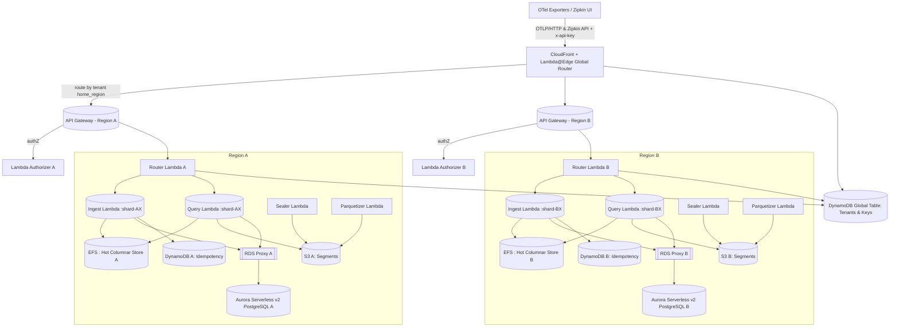
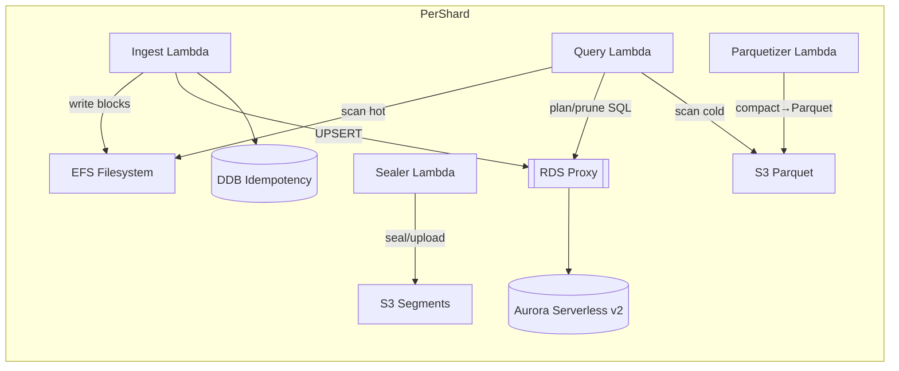

# Prism: High-Level Architecture

**Serverless OTel Analytics Platform Architecture**

## Architecture Overview

Prism is built as a serverless, multi-region, sharded analytics platform for OpenTelemetry data. The architecture follows a distributed design with regional cells for data residency, automatic scaling, and tenant isolation.

## Key Architectural Principles

1. **Serverless-First**: All compute components run on AWS Lambda for automatic scaling
2. **Regional Isolation**: Each region operates independently with its own data stores
3. **Tenant Sharding**: Horizontal scaling through tenant-aware sharding
4. **Tiered Storage**: Hot (EFS) → Warm (S3 blocks) → Cold (Parquet) progression
5. **Event-Driven**: Asynchronous processing for lifecycle management

## High-Level Topology

### Data Flow Overview

```
OTLP → Ingest Lambda → Columnar Blocks (EFS) → Commit Manifest → Seal → Upload to S3 → Parquetize
                          ↓
                    Query Lambda ← Arrow Flight SQL (Hot EFS + Cold Parquet) ← Plan (Aurora SQL)
```

**Arrow Flight SQL Integration**: The query subsystem implements an Arrow Flight SQL server that provides a unified SQL interface over both hot storage (EFS columnar blocks) and cold storage (Parquet files). This component abstracts storage tier complexities behind a standard SQL interface while leveraging Arrow's vectorized processing capabilities for high-performance analytics.

### Request Flow

1. **Global Routing**: CloudFront + Lambda@Edge routes by API key to tenant home region
2. **Regional Processing**: API Gateway → Authorizer → Router → Shard-specific Lambdas
3. **Data Processing**: Ingest/Query Lambdas operate on tenant-isolated data stores

## C4 Architecture Diagrams

### C1: System Context (Multi-Region)



### C2: Container Diagram (Per Regional Shard)



### C3: Components (Query Processing & Shard Management)

```mermaid
flowchart TB
  subgraph QueryLambda
    plan[Planner] --> prune[Pruner stats/dicts/blooms]
    prune --> execHot[Hot Reader EFS Blocks]
    prune --> execCold[Cold Reader Parquet]
    execHot --> agg[Aggregator t‑digest/HLL]
    execCold --> agg
    agg --> format[Formatter Zipkin/DSL]
  end
  subgraph ShardManager
    metrics[Metrics Ingest CloudWatch/OTel] --> analyzer[Hotspot Analyzer]
    analyzer --> decisions[Move Plan Builder]
    decisions --> migrator[Shard Migrator DataSync + Cutover]
    migrator --> tenants[Tenants DDB Update]
    migrator --> hints[Dual‑Read Window Config]
```

## Core Components

### Global Layer

#### CloudFront + Lambda@Edge
- **Purpose**: Global request routing and API key resolution
- **Function**: Routes requests to tenant home regions
- **Caching**: 5-10 minute TTL for tenant→region mapping
- **Protocols**: OTLP/HTTP, Zipkin APIs

#### Tenant Management (DynamoDB Global Table)
- **Purpose**: Authoritative tenant registry
- **Data**: `apiKeyId`, `tenant_id`, `home_region`, `shard_id`, `residency_policy`
- **Global**: Multi-region replication for routing decisions

### Regional Components

#### API Gateway & Lambda Authorizer
- **Purpose**: Regional entry point with authentication/authorization
- **Function**: Validates API keys, extracts tenant context
- **Output**: `{tenant_id, shard_id}` for downstream processing

#### Router Lambda
- **Purpose**: Routes tenant requests to appropriate shard-specific Lambdas
- **Function**: Maps tenant to shard, invokes target Lambda with qualifier
- **Scaling**: Per-region deployment with reserved concurrency

### Data Processing Layer

#### Ingest Lambda (Per Shard)
- **Purpose**: OTLP data ingestion and columnar encoding
- **Function**: Normalizes OTel data → columnar blocks → atomic commits
- **Storage**: Writes to EFS with NFS symlink locking
- **Catalog**: Updates Aurora with segment metadata

#### Query Lambda (Per Shard)
- **Purpose**: Zipkin-compatible query processing
- **Function**: Hybrid planner reading hot EFS + cold Parquet
- **APIs**: Zipkin v2, custom JSON DSL
- **Optimization**: Stats-based pruning, vectorized execution

#### Sealer Lambda
- **Purpose**: Lifecycle management for segment sealing
- **Trigger**: Time-based (segment age) or size-based thresholds
- **Function**: Uploads EFS segments to S3, updates catalog state

#### Parquetizer Lambda
- **Purpose**: Compaction and cold storage optimization
- **Function**: Converts sealed segments to Parquet format
- **Scheduling**: Post-lateness window processing
- **Optimization**: Row group sizing, compression, indexing

### Storage Layer

#### EFS (Hot Storage)
- **Purpose**: Low-latency columnar storage for recent data
- **Structure**: Tenant-isolated directories with time-boxed segments
- **Access**: EFS Access Points for security isolation
- **Performance**: Provisioned throughput for predictable performance

#### S3 (Warm/Cold Storage)
- **Purpose**: Cost-effective storage for aged data
- **Tiers**: Raw segments (warm) → Parquet files (cold)
- **Organization**: Partitioned by shard, tenant, dataset, time
- **Security**: KMS encryption with regional keys

#### Aurora Serverless v2 (Metadata Catalog)
- **Purpose**: Authoritative metadata store for query planning
- **Schema**: Segments, block stats, trace hints, virtual datasets
- **Access**: RDS Proxy with IAM authentication
- **Scaling**: Auto-scaling capacity units

#### DynamoDB (Regional)
- **Purpose**: Idempotency tracking and operational state
- **Tables**: `idempotency-shard-XX` for duplicate detection
- **Performance**: On-demand billing with burst capacity

## Data Architecture

### Data Model

#### Signal Types and Schema Mapping

The platform processes OpenTelemetry signals by transforming them into a unified eventized row format that enables efficient analytical queries while preserving full fidelity of the original telemetry data.

**Spans** are transformed into rows containing core span information including trace and span identifiers, timing data, operation names, and status information. Span attributes are flattened into columns with the `span.attr.` prefix, while span events become separate rows linked by span ID. Resource attributes follow the `resource.` prefix pattern, and instrumentation scope information uses `scope.` prefixes.

**Logs** become individual rows with log body content, severity levels, and timestamp information. Log attributes are flattened using the `log.attr.` prefix, while resource and scope information follows the same patterns as spans. W3C trace context information is preserved when present, enabling correlation with distributed traces.

**Metrics** are eventized by creating individual rows for each metric data point, preserving temporal information and measurement metadata. Gauge and counter values become direct column values, while histogram metrics are expanded into multiple rows representing individual buckets and summary statistics. Metric attributes use the `metric.attr.` prefix pattern.

#### Unified Column Schema

All signal types share a common base schema that enables cross-signal analytics and efficient storage organization:

**Core Identity Columns**: Every row includes `tenant_id` for multi-tenant isolation, `dataset` for logical grouping, and `signal_type` to distinguish between logs, spans, and metrics.

**Temporal Columns**: `timestamp` contains the original event timestamp with nanosecond precision, while `ingest_ts` records when the data was received by the platform. This dual timestamp approach enables both business-time and processing-time analytics.

**Distributed Context Columns**: W3C compliant trace context is preserved through `trace_id`, `span_id`, `trace_state`, and `trace_flags` columns. Baggage information is stored in columns with the `ctx.baggage.` prefix, enabling propagation analysis across service boundaries.

**Resource and Scope Columns**: OpenTelemetry resource attributes are mapped to columns with the `resource.` prefix, including common attributes like `resource.service.name` and `resource.service.version`. Instrumentation scope information uses the `scope.` prefix for attributes like `scope.name` and `scope.version`.

### Storage Terminology

The platform uses precise terminology to distinguish between different levels of data organization:

**Segments** represent time-bounded containers (typically 5-minute windows) that group related data for efficient processing and lifecycle management. Each segment contains multiple columnar blocks and maintains its own manifest, locking mechanisms, and metadata. Segments progress through lifecycle states (open, sealing, sealed, parquetized) that govern their processing and accessibility.

**Blocks** are the fundamental units of columnar storage within segments. Each block contains compressed, encoded data for a single column across the rows in that segment. Blocks include their own statistics, encoding metadata, and optional index structures like Bloom filters. The block is the smallest unit for I/O operations and query processing.

This hierarchical organization enables efficient time-based queries (segment-level), fine-grained I/O optimization (block-level), and effective lifecycle management (segment transitions between storage tiers).

### Storage Layout

#### EFS Structure
```
/efs/tenants/<tenant>/datasets/<dataset>/
  segments/<segment_id>/                  # 5‑min time window
    .lock → lease-<uuid>@<expires>       # Segment-level lease
    .commit (lockfile)                   # Commit operation lock
    .seal (lockfile)                     # Sealing operation lock
    manifest/ 000012.json 000013.json    # Versioned manifests
    HEAD → manifest/latest.json          # Current manifest pointer
    columns/<column_name>/               # Per-column storage
      blocks/000001.blk 000002.blk      # Columnar data blocks
      stats/000001.json 000002.json     # Per-block statistics
      dict/dictionary.dict               # Column dictionary
    _segment.meta                        # Segment metadata
```

#### S3 Organization
- **Segments**: `s3://.../shard=XX/tenants/<tenant>/datasets/<dataset>/seg/p=<hash>/<segment_id>/`
- **Parquet**: `s3://.../shard=XX/tenant=<tenant>/dataset=<dataset>/dt=YYYY‑MM‑DD/hour=HH/part‑000.parquet`

## Multi-Tenancy & Sharding

### Tenant Isolation

#### Data Isolation
- **EFS**: Access Points with tenant-specific root directories
- **S3**: Bucket prefixes with tenant-scoped IAM policies
- **Aurora**: Row-level security with tenant_id filtering
- **DynamoDB**: Partition keys include tenant identifier

#### Compute Isolation
- **Lambda**: Shard-specific function qualifiers
- **Networking**: VPC isolation and security groups
- **IAM**: Least-privilege policies per component

### Sharding Strategy

#### Shard Assignment
- **Algorithm**: Rendezvous hashing for consistent assignment
- **Factors**: Tenant ID, capacity weights, current utilization
- **Rebalancing**: Automated based on hotspot detection

#### Hotspot Detection
- **Metrics**: EFS utilization, query latency, throughput
- **Thresholds**: `efs_util > 80%` AND `query_p95 > SLO`
- **Response**: Automatic shard migration with dual-read window

## Inter-Service Communication

### Service Integration Protocols

The platform implements standardized communication patterns between subsystems to ensure reliable data flow and consistent error handling across the distributed architecture.

#### Ingest to Catalog Communication

The Ingest subsystem communicates with the Catalog subsystem through direct Aurora database connections for metadata operations. Each successful segment commit triggers an UPSERT operation to the segments table that includes segment metadata, block statistics, and lifecycle state information.

The communication protocol uses transactional semantics where catalog updates must succeed for the overall ingest operation to be considered complete. Failed catalog updates trigger rollback procedures that remove uncommitted data from EFS storage, ensuring consistency between storage and metadata systems.

#### Query to Storage Communication

The Query subsystem accesses storage tiers through a unified interface that abstracts the complexities of reading from both EFS columnar blocks and S3 Parquet files. The Arrow Flight SQL server coordinates these operations by translating SQL queries into appropriate storage access patterns.

For EFS access, the query engine reads blocks directly through filesystem operations, applying decompression and decoding as needed. For S3 access, the system utilizes optimized Parquet readers with predicate pushdown capabilities. The storage coordinator component manages these parallel access patterns and merges results into unified Arrow record batches.

#### Sharding to Service Communication

The Sharding subsystem communicates with all other services through tenant context propagation and migration coordination protocols. Tenant context flows from the Lambda Authorizer through request headers that identify the tenant, shard assignment, and any active migration state.

During migrations, the sharding system coordinates with services through a dual-read protocol where queries temporarily access both source and destination shards. Migration completion notifications trigger cleanup operations across all affected services to remove data from source shards and update routing configurations.

### Event-Driven Architecture

#### Storage Lifecycle Events

The Storage subsystem generates events for segment lifecycle transitions that trigger downstream processing. Segment sealing events initiate upload to S3 warm storage, while parquetization events trigger conversion to cold storage format. These events flow through EventBridge to coordinate processing across multiple Lambda functions.

Event payloads include complete segment metadata, tenant context, and processing instructions that enable receiving services to perform their operations without additional coordination. Failed event processing triggers retry logic with exponential backoff and dead letter queue handling for persistent failures.

#### Monitoring and Observability Events

All subsystems emit structured events for monitoring, alerting, and operational visibility. These events follow standardized schemas that enable cross-service correlation and analysis. Performance metrics, error conditions, and business events flow through CloudWatch and custom telemetry systems for comprehensive platform observability.

## Cross-Region Architecture

### Data Residency Policies

#### Strict Policy
- **Behavior**: No cross-region processing
- **Failure Mode**: Return 503 if home region unavailable
- **Use Case**: Compliance-sensitive workloads

#### Permitted Policy
- **Behavior**: Async Parquet replication to secondary regions
- **Failure Mode**: Query failover to replicated data
- **Use Case**: DR-enabled deployments

#### Deferred Policy
- **Behavior**: Queue ingest at edge during outages
- **Failure Mode**: Replay to home region when healthy
- **Use Case**: Eventually consistent requirements

### Regional Independence

#### Regional Components
- Each region maintains complete independence
- No cross-region runtime dependencies
- Regional Aurora catalogs with local metadata

#### Global Components
- Tenant registry (DynamoDB Global Table)
- CDN routing (CloudFront + Lambda@Edge)

## Performance Characteristics

### Throughput Targets
- **Ingest**: 100k+ events/second per tenant
- **Query**: 1000+ concurrent queries per region
- **Storage**: PB-scale per tenant capability

### Latency Targets
- **Ingest**: p99 < 500ms per batch
- **Hot Queries**: p95 < 2s for recent data
- **Visibility**: < 2s from ingest to queryable

### Scalability
- **Horizontal**: Automatic Lambda scaling
- **Vertical**: Memory/CPU optimization per workload
- **Storage**: Elastic scaling with lifecycle management

## Security Architecture

### Authentication & Authorization
- **API Keys**: Tenant-scoped authentication
- **IAM**: Component-level authorization
- **Network**: VPC isolation and security groups

### Encryption
- **Transit**: TLS 1.2+ for all communications
- **Rest**: KMS encryption with regional keys
- **Application**: No plaintext sensitive data

### Compliance
- **Data Residency**: Regional data boundaries
- **Audit**: CloudTrail logging with tenant context
- **Access Control**: Least-privilege principle

## Operational Characteristics

### Monitoring & Observability
- **Metrics**: CloudWatch + custom OTel emissions
- **Logging**: Structured logs with tenant correlation
- **Tracing**: Self-hosting for platform observability

### Deployment & Configuration
- **Infrastructure**: Comprehensive Terraform modules detailed in infrastructure.md
- **Regional Consistency**: Standardized deployment patterns across regions
- **Service Integration**: Coordinated provisioning of interdependent resources


## Technology Stack

### Compute
- **AWS Lambda**: Arm64 (Graviton) for cost/performance
- **Runtime**: Python 3.11+ with native extensions
- **Query Engine**: Apache Arrow Flight SQL for columnar data access

### Storage
- **Amazon EFS**: General Purpose with Provisioned Throughput
- **Amazon S3**: Standard/IA/Glacier lifecycle management
- **Aurora Serverless v2**: PostgreSQL 15 with Multi-AZ

### Networking
- **CloudFront**: Global CDN with Lambda@Edge
- **API Gateway**: Regional endpoints with custom domains
- **VPC**: Multi-AZ with private subnets

### Security
- **IAM**: Role-based access control
- **KMS**: Regional key management
- **Secrets Manager**: Credential rotation
