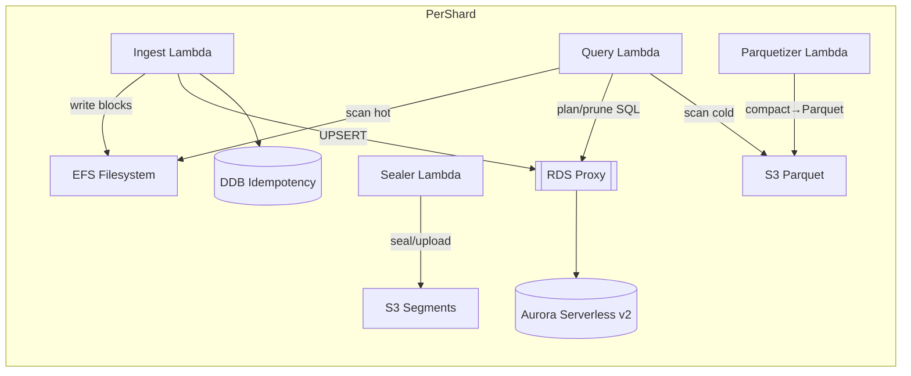
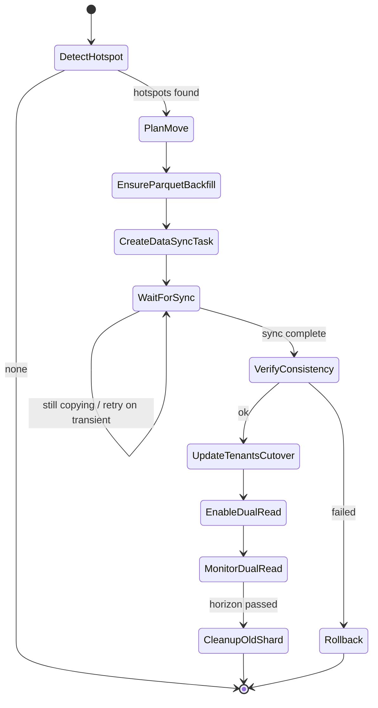

# Serverless OTel Analytics Architecture (Sharded, Multi‑Region)

**Status:** Draft v3.0
**Author:** —
**Scope:** End‑to‑end design for ingest, storage, query, and operations of a columnar telemetry store using AWS Lambda, EFS, S3/Parquet, **Aurora Serverless v2 (PostgreSQL)** for catalog metadata, and per‑tenant **sharded, multi‑region** cells.

---

## 1) Objectives & Non‑Goals

### 1.1 Objectives

* Low‑latency, high‑throughput ingest for **OTel** (logs, traces, metrics → eventized rows).
* **Columnar, append‑only** hot store on EFS with **time‑boxed segments** (small files, per column).
* **Atomic appends** using **NFS symlink locks**.
* **Hot/warm/cold tiering:** EFS → S3 blocks → **Parquet** after lateness (compaction for cost/scan efficiency).
* **Serverless query service** (Lambda) speaking **Zipkin‑compatible APIs** and a JSON DSL, with a **hybrid planner** that reads both hot EFS blocks and Parquet on S3.
* **Multi‑tenancy with sharding** Tenants are isolated and unaware of sharing.
* **Automatic hotspot detection & shard rebalancing** with zero visible impact to tenants.
* **Data residency:** tenants pinned to **home regions**; optional secondary regions for DR per policy.
* **Minimal indexing**, reliance on time partitioning, per‑block stats, small dictionaries, optional blooms/cuckoo filters, and parallel fan‑out.

### 1.2 Non‑Goals

* Not a general OLAP warehouse; optimized for telemetry patterns (scan‑heavy, append‑only, late materialization).

---

## 2) C4 Model Diagrams

> Diagrams use Mermaid (C1–C3). Code‑level details appear in algorithm sketches.

### C1: System Context (Multi‑Region)

```mermaid
flowchart TB
  user[OTel Exporters / Zipkin UI]
  cf[CloudFront + Lambda@Edge (Global Router)]
  user -->|OTLP/HTTP & Zipkin API + x-api-key| cf
  cf -->|route by tenant home_region| apigwA[(API Gateway - Region A)]
  cf --> apigwB[(API Gateway - Region B)]

  apigwA -->|authZ| authorizerA[Lambda Authorizer (A)]
  apigwB -->|authZ| authorizerB[Lambda Authorizer (B)]

  apigwA --> routerA[Router Lambda (A)]
  apigwB --> routerB[Router Lambda (B)]

  subgraph Region A
    routerA --> ingestA[(Ingest Lambda :shard‑AX)]
    routerA --> queryA[(Query Lambda :shard‑AX)]
    ingestA --> efsA[(EFS : Hot Columnar Store A)]
    queryA --> efsA
    sealerA[Sealer Lambda] --> s3A[(S3 A: Segments)]
    parquetizerA[Parquetizer Lambda] --> s3A
    queryA --> s3A
    rdsproxyA[[RDS Proxy A]] --> auroraA[(Aurora Serverless v2 (PostgreSQL) A)]
    ingestA --> rdsproxyA
    queryA --> rdsproxyA
    idemA[(DynamoDB A: Idempotency)]
    ingestA --> idemA
  end

  subgraph Region B
    routerB --> ingestB[(Ingest Lambda :shard‑BX)]
    routerB --> queryB[(Query Lambda :shard‑BX)]
    ingestB --> efsB[(EFS : Hot Columnar Store B)]
    queryB --> efsB
    sealerB[Sealer Lambda] --> s3B[(S3 B: Segments)]
    parquetizerB[Parquetizer Lambda] --> s3B
    queryB --> s3B
    rdsproxyB[[RDS Proxy B]] --> auroraB[(Aurora Serverless v2 (PostgreSQL) B)]
    ingestB --> rdsproxyB
    queryB --> rdsproxyB
    idemB[(DynamoDB B: Idempotency)]
    ingestB --> idemB
  end

  tenants[(DynamoDB Global Table: Tenants & Keys)]
  cf --> tenants
  routerA --> tenants
  routerB --> tenants
```

### C2: Container Diagram (Per Shard)



### C3: Components (Query & Rebalance)

```mermaid
flowchart TB
  subgraph QueryLambda
    plan[Planner] --> prune[Pruner (stats/dicts/blooms)]
    prune --> execHot[Hot Reader (EFS Blocks)]
    prune --> execCold[Cold Reader (Parquet)]
    execHot --> agg[Aggregator (t‑digest/HLL)]
    execCold --> agg
    agg --> format[Formatter (Zipkin/DSL)]
  end
  subgraph ShardManager
    metrics[Metrics Ingest (CloudWatch/OTel)] --> analyzer[Hotspot Analyzer]
    analyzer --> decisions[Move Plan Builder]
    decisions --> migrator[Shard Migrator (DataSync + Cutover)]
    migrator --> tenants[Tenants DDB Update]
    migrator --> hints[Dual‑Read Window Config]
```

---

## 3) High‑Level Topology

**Ingest path:** OTLP → Ingest Lambda → encode columnar blocks → → commit manifest → seal → upload to S3 → Parquetize after lateness window passes.

**Query path:** Zipkin/DSL → Query Lambda → plan (**SQL prune via Aurora**) → read hot EFS + cold Parquet → aggregate → format.

**Multi‑region sharding:** CloudFront+Edge routes by `x-api-key` to tenant **home region**; regional Authorizer/Router invoke `:shard‑XX` Lambdas to distribute compute.

---

## 4) Multi‑Tenancy, Sharding & Auto‑Rebalancing

### 4.1 Tenant Identity, Residency & Routing

* **Tenants (DynamoDB Global Table):** `apiKeyId`, `tenant_id`, `home_region`, `shard_id`, `residency_policy` (`strict|permitted|deferred`), `secondary_regions[]`, limits/status.
* **Lambda\@Edge** routes each request to the tenant’s **home region** API Gateway origin; caches mapping 5–10 minutes.
* **Regional Authorizer + Router** pass `{tenant_id, shard_id}` to the shard Lamdbas.

### 4.2 Isolation & Invisibility

* Per‑region **cells**: each region hosts its own shards (EFS, Aurora, S3). Tenants are **pinned** to their home region; users never see region/shard details.
* Enforced by IAM: EFS Access Points, S3 prefixes with per‑region KMS CMKs, Aurora IAM auth; DDB conditions for tenant rows.

### 4.3 Automatic Hotspot Detection & Intra‑Region Rebalancing

* Metrics: ingest TPS, EFS IOPS/throughput, query bytes, p95 latency, throttles.
* Heuristic: `efs_utilization>0.8 && query_p95>SLO` for `N` minutes or fairness skew for `M` minutes.
* Plan: choose **target shard in same region** (Rendezvous hashing with capacity), backfill Parquet, DataSync hot EFS, set `migrate_to` & `cutover_ts`, enable **dual‑read** window; then clean old paths. Writes switch at cutover; reads span both until hot window expires.

**Pseudocode — Global Router @Edge**

```python
TENANT_CACHE = TTLCache(ttl_seconds=600)

def edge_route(request):
    api_key = request.headers.get('x-api-key')
    rec = TENANT_CACHE.get(api_key) or tenants_gt.get(apiKeyId=api_key)
    if not rec: return deny(401)
    request.origin = f"api.{rec.home_region}.example.com"
    request.headers['x-tenant-id'] = rec.tenant_id
    return request
```

**Pseudocode — Hotspot Analyzer & Rebalancer**

```python
from datetime import datetime, timedelta
SLO={"query_p95_ms":2000,"efs_util_max":0.80}; WINDOW=timedelta(minutes=10); DUAL_H=2

def analyze_hotspots(metrics_by_tenant):
    return [t for t,m in metrics_by_tenant.items()
            if (m.efs_util_avg(WINDOW)>SLO['efs_util_max'] and m.query_p95(WINDOW)>SLO['query_p95_ms'])
               or m.fair_share_exceeded(WINDOW)]

def plan_move(tenant_id, shards):
    ranked=sorted(shards,key=lambda s:-rendezvous_score(tenant_id,s.id,s.capacity_weight))
    return next((s for s in ranked if s.utilization<0.6), ranked[-1])

def execute_rebalance(tenant_id, src, dst, now):
    ensure_parquet_backfill(tenant_id, src, dst)
    start_datasync_copy(src.efs_path(tenant_id), dst.efs_path(tenant_id))
    cutover_ts = now + timedelta(minutes=5)
    tenants_table.update(api_key=lookup_api_key(tenant_id), migrate_to=dst.id, cutover_ts=cutover_ts.isoformat())
    hints_table.put(tenant_id=tenant_id, dual_read_until=(now + timedelta(hours=DUAL_H)).isoformat())
```

#### Step Functions State Machine (Rebalance)



### 4.4 Cross‑Region Policies & DR

* `strict`: no cross‑region processing; if home region is down, return 503 or buffer at edge (SQS) until recovery.
* `permitted`: asynchronously replicate **Parquet** to a secondary region; queries may fail over; ingest cutover is manual.
* `deferred`: queue ingest per tenant at the edge and replay to home region when healthy.

---

## 5) Data Model (OTel → Event Rows)

### 5.1 Common Columns

* `tenant_id (string)`, `dataset (string)`, `signal_type (enum: log|span|metric)`, `timestamp (int64 ns)`, `ingest_ts (int64 ns)`
* `service_name (string)`, `resource.* (string/number/bool)`, `scope.* (string)` (incl. `scope.name`, `scope.version`, `scope.schema_url`)
* **Context:** `trace_state (string)`, `ctx.baggage.* (string)` (flattened W3C baggage K/V)

### 5.2 Spans

* `trace_id (bytes16)`, `span_id (bytes8)`, `parent_span_id (bytes8)`, `flags (uint8)`
* `name (string)`, `kind (enum)`, `status_code (enum)`, `status_message (string)`, `duration_ms (int32)`
* `dropped_attributes_count (int)`, `dropped_events_count (int)`, `dropped_links_count (int)`
* `span_attr.*` (typed)
* **Child datasets:** `span_events(span_id,timestamp,name,event_attr.*)`, `span_links(span_id,linked_trace_id,linked_span_id,link_attr.*)`

### 5.3 Logs

* `body (string|bytes)`, `severity_text (string)`, `severity_number (int)`, `observed_ts (int64 ns)`; `log_attr.*`; optional `trace_id?`, `span_id?`

### 5.4 Metrics (Eventized)

* `metric_name (string)`, `metric_type (enum)`, `unit (string)`, `start_ts (int64 ns)`
* **Gauge/Sum:** `value (float64|int64)`, `is_monotonic? (bool)`, `temporality (enum)`
* **Histogram:** `count (int64)`, `sum (float64)`, `bounds[]`, `counts[]`
* **Exponential Histogram:** `scale (int)`, `zero_count (int64)`, `pos.offset`, `pos.buckets[]`, `neg.offset`, `neg.buckets[]`
* **Exemplars dataset:** `exemplar_ts`, `value`, `filtered_attributes.*`, optional `trace_id/span_id`

### 5.5 Baggage & Tracestate Handling

* **Capture:** OTLP `trace_state`; headers `baggage` / mapped attributes. Ingest normalizes to `ctx.baggage.<k>=<v>` columns.
* **Storage:** `ctx.baggage.*` dictionary‑encoded; Parquet nested map.
* **Querying:** filters like `{col:"ctx.baggage.userId", op:"=", val:"123"}`; Zipkin `tags` map into baggage/attributes.

---

## 6) Hot Store on EFS (Columnar + Segments)

### 6.1 Layout

```
/efs/tenants/<tenant>/datasets/<dataset>/
  segments/<segment_id>/                  # 5‑min window
    .lock → lease-<uuid>@<expires>
    .commit (lockfile)  .seal (lockfile)
    manifest/ 000012.json 000013.json
    HEAD
    columns/<name>/blocks/*.blk  columns/<name>/stats/*.json  columns/<name>/dict/*.dict
    _segment.meta
```

### 6.2 Policy

* Window **5 m**; lateness **30 m**. States: `open → sealing → sealed → parquetized`.
* Late arrivals → **delta segment**; merged at Parquetization.

### 6.3 Encoding

* Blocks (\~**2–4 MB**): ints = delta+varint(+RLE); timestamps = delta‑of‑delta; strings = dictionary(+RLE). **Zstd** lvl 1–3.
* Per‑block stats: `min`, `max`, `row_count`, `null_count`, top‑K dict; optional **Bloom/Cuckoo** filter.

### 6.4 Atomicity & Fine‑Grained Locks

* **Lockless staging:** write to `.staging/<writer_id>/...` unique paths, then `rename()` into `blocks/`.
* **Commit lock (short, per‑segment):** held only to write new manifest and atomically `rename()` `HEAD`.
* **Seal lock (per‑segment):** exclusive during sealing/upload to disallow further commits into that segment; late data redirected to delta.

**Pseudocode - Minimal Locking Commit**

```python
def commit_segment(seg_path, stage_paths):
    for p in stage_paths.blocks: os.rename(p.tmp, p.final)
    token = acquire_lock(os.path.join(seg_path, ".commit"), ttl_s=5, wait_s=2)
    try:
        manifest = write_new_manifest(seg_path, stage_paths)
        atomic_rename_head(seg_path, manifest)
    finally:
        release_lock(os.path.join(seg_path, ".commit"), token)
```

**Pseudocode — Sealing**

```python
def seal_segment(seg_path):
    seal = acquire_lock(os.path.join(seg_path, ".seal"), ttl_s=60, wait_s=10)
    try:
        mark_meta(seg_path, state="sealing")
        upload_segment_to_s3(seg_path)
        mark_meta(seg_path, state="sealed")
    finally:
        release_lock(os.path.join(seg_path, ".seal"), seal)
```

---

## 7) Cold/Warm Store & Parquetization

### 7.1 Sealing & Upload

* Trigger: segment age > window + lateness OR size threshold.
* Upload segment dir to S3: `s3://.../shard=XX/tenants/<tenant>/datasets/<dataset>/seg/p=<hash>/<segment_id>/...`
* Catalog state → `sealed` with S3 keys.

### 7.2 Parquet After Lateness

* **Parquetizer Lambda** compacts sealed (+delta) segments by `(tenant,dataset,hour)` → Parquet files.
* Parquet: **row groups 128–512 MB**, compression Zstd (or Snappy), optional Bloom on `trace_id`, `service_name`.
* Path: `.../shard=XX/tenant=<tenant>/dataset=<dataset>/dt=YYYY‑MM‑DD/hour=HH/part‑000.parquet`.
* Register/refresh **Glue**; mark `parquetized`; optionally delete S3 block copies after N days.

**Pseudocode — Parquetizer**

```python
def parquetize(hour, tenant, dataset, shard):
    segs = catalog.list_sealed_segments(tenant, dataset, hour, shard)
    files = materialize_to_parquet(segs)
    glue.add_partitions(tenant, dataset, hour, files)
    catalog.mark_parquetized(segs)
```

---

## 8) Metadata Catalog (Aurora Serverless SQL)

### 8.1 Architecture

* **Engine:** Aurora Serverless v2 (PostgreSQL 15) per region; **Multi‑AZ**, autoscaling capacity.
* **Connectivity:** **RDS Proxy** (IAM auth) for Lambda connection pooling.
* **Security:** IAM DB auth, Secrets rotation, TLS, encryption at rest.
* **Purpose:** authoritative catalog of segments, per‑block stats, trace hints, virtual datasets, and planning metadata **within a region**.
* **DynamoDB retained:** `tenants` (Global Table) and `idempotency‑shard‑XX` (regional) remain in DDB.

### 8.2 Schema (DDL snippets)

```sql
CREATE TYPE segment_state AS ENUM ('open','sealing','sealed','parquetized');

CREATE TABLE segments (
  tenant_id   text NOT NULL,
  dataset     text NOT NULL,
  segment_id  text NOT NULL,
  t_min       timestamptz NOT NULL,
  t_max       timestamptz NOT NULL,
  rows        bigint NOT NULL,
  state       segment_state NOT NULL,
  efs_path    text NOT NULL,
  s3_prefix   text,
  has_blooms  boolean DEFAULT false,
  has_dicts   boolean DEFAULT true,
  sealed_at   timestamptz,
  parquetized_at timestamptz,
  PRIMARY KEY (tenant_id, dataset, segment_id)
) PARTITION BY RANGE (t_min);

CREATE TABLE block_stats (
  tenant_id   text NOT NULL,
  dataset     text NOT NULL,
  segment_id  text NOT NULL,
  column_name text NOT NULL,
  block_id    text NOT NULL,
  row_count   integer NOT NULL,
  null_count  integer NOT NULL,
  minmax      jsonb   NOT NULL,
  topk        jsonb,
  bloom       bytea,
  PRIMARY KEY (tenant_id, dataset, segment_id, column_name, block_id)
);
CREATE INDEX ON block_stats (tenant_id, dataset, column_name);

CREATE TABLE trace_hints (
  tenant_id   text NOT NULL,
  dataset     text NOT NULL,
  trace_id    bytea NOT NULL,
  hour        timestamptz NOT NULL,
  locations   jsonb NOT NULL,
  expires_at  timestamptz NOT NULL,
  PRIMARY KEY (tenant_id, dataset, trace_id, hour)
);
CREATE INDEX trace_hints_exp ON trace_hints (expires_at);

CREATE TABLE virtual_containers (
  tenant_id   text NOT NULL,
  name        text NOT NULL,
  PRIMARY KEY (tenant_id, name)
);
CREATE TABLE virtual_members (
  tenant_id   text NOT NULL,
  name        text NOT NULL,
  dataset     text NOT NULL,
  PRIMARY KEY (tenant_id, name, dataset)
);
```

### 8.3 Planner Queries (Examples)

```sql
-- Candidate segments for a time window
SELECT segment_id, t_min, t_max, state, efs_path, s3_prefix, has_blooms, has_dicts
FROM segments
WHERE tenant_id = $1 AND dataset = ANY($2)
  AND t_max >= $3 AND t_min <= $4
ORDER BY t_min;

-- Block stats for referenced columns
SELECT column_name, block_id, row_count, null_count, minmax, topk, bloom
FROM block_stats
WHERE tenant_id = $1 AND dataset = $2 AND segment_id = ANY($3)
  AND column_name = ANY($4);

-- Trace fast‑path
SELECT hour, locations
FROM trace_hints
WHERE tenant_id = $1 AND dataset = $2 AND trace_id = $3
  AND hour BETWEEN date_trunc('hour',$4) AND date_trunc('hour',$5);

-- Expire old hints
DELETE FROM trace_hints WHERE expires_at < now();
```

### 8.4 Transactions & Visibility

* Ingest commits Aurora **after** EFS `HEAD` is atomically advanced (catalog UPSERT in one transaction).
* Sealing & Parquetization update `state/s3_prefix/timestamps` transactionally.
* Planner tolerates missing stats by conservative scans.

### 8.5 Lambda Access

* Use **RDS Proxy** with IAM auth; set `statement_timeout` (5–10 s) via init query.
* Prefer prepared statements; read at Aurora **reader** endpoint; write at **writer** endpoint.
* **Regional only:** shard Lambdas connect to the **regional Aurora** (no cross‑region DB calls).

---

## 9) Ingest Service (Lambda)

**Pseudocode — Ingest Commit**

```python
def handle_otlp_request(req, ctx):
    tenant = ctx.tenant_id
    ctx_headers = extract_context_headers(req.headers)  # traceparent/tracestate/baggage
    baggage = parse_w3c_baggage(ctx_headers.get("baggage"))

    events = normalize_otlp(req, baggage=baggage)
    by_seg = partition_by_window(events, window_minutes=5, lateness_minutes=30)

    for seg_id, colar in by_seg.items():
        seg_path = efs_path(tenant, req.dataset, seg_id)
        stage_paths = write_blocks_to_staging(seg_path, colar)
        for p in stage_paths.blocks: os.rename(p.tmp, p.final)  # lockless
        token = acquire_lock(os.path.join(seg_path, ".commit"), ttl_s=5, wait_s=2)
        try:
            manifest = append_manifest(seg_path, stage_paths)
            atomic_rename_head(seg_path, manifest)
            catalog.upsert_segment_and_stats(tenant, req.dataset, seg_id, stage_paths.stats)
        finally:
            release_lock(os.path.join(seg_path, ".commit"), token)
```

---

## 10) Query Service (Lambda)

### 10.1 APIs

* **Zipkin v2**: traces, services, spans, dependencies.
* **JSON DSL**: `POST /v1/query` (supports filters on baggage/tracestate/resource/scope/events/links/exemplars).

### 10.2 Planner & Engine (Aurora‑assisted)

```python
import psycopg
SQL_SEGMENTS = """
SELECT segment_id,t_min,t_max,state,efs_path,s3_prefix,has_blooms,has_dicts
FROM segments
WHERE tenant_id=%s AND dataset = ANY(%s) AND t_max>=%s AND t_min<=%s
ORDER BY t_min
"""
SQL_BLOCKS = """
SELECT column_name,block_id,row_count,null_count,minmax,topk,bloom
FROM block_stats
WHERE tenant_id=%s AND dataset=%s AND segment_id = ANY(%s) AND column_name = ANY(%s)
"""

def run_query(req, ctx, conn):
    t = ctx.tenant_id
    dsets = resolve_virtual_or_real(req.dataset, t)
    cand = conn.execute(SQL_SEGMENTS, (t, dsets, req.time.from_, req.time.to)).fetchall()
    hot, cold = split_by_state(cand)
    cols = plan_projection(req)
    stats = conn.execute(SQL_BLOCKS, (t, req.dataset, [c.segment_id for c in cand], cols)).fetchall()
    hot_pruned = prune_blocks(hot, req.where, stats)
    cold_pruned = prune_parquet(cold, req.where)
    res_hot = read_efs_blocks(hot_pruned, cols)
    res_cold = read_parquet_objects(cold_pruned, cols, pushdown=req.where)
    rows = merge_rows(res_hot, res_cold)
    if needs_child_join(req): rows = join_children(t, rows=rows, req=req)
    out = aggregate(rows, req.agg, req.groupBy)
    return format_result(out, req.output or "zipkin")
```

### 10.3 Fan‑Out (heavy queries)

```python
def maybe_fanout(plan):
    if plan.estimated_bytes > 4*1024**3 or plan.shards > 200:
        return stepfunctions.map_shards(plan)
    return execute_locally(plan)
```

---

## 11) Virtual Datasets (Per Tenant)

* `/virtual/containers/<name>/segments/` with **symlinks** to member segments across datasets.
* Planner treats container as a dataset; adds synthetic `virtual_dataset` at read time.

---

## 12) Security & Compliance

* **Authn:** API key → Authorizer → `{tenant_id, shard_id}` (from Tenants DDB Global Table).
* **Authz:** IAM on EFS AP root; S3 prefixes with **SSE‑KMS** (per‑region CMKs); Aurora via **IAM auth**; DDB `LeadingKeys` by `tenant_id#`.
* **Encryption:** TLS in transit; KMS at rest. Replication re‑encrypts using destination region CMKs.
* **Audit:** CloudTrail; structured logs with `tenant_id` (no region/shard in user‑visible logs).

---

## 13) Performance & Sizing

* **Lambda:** **arm64 (Graviton)**; memory 2–4 GB to unlock network throughput & faster Zstd; **Provisioned Concurrency** on hot paths.
* **Front door:** HTTP/2; prefer **OTLP/HTTP (protobuf)**; ALB shim for OTLP/gRPC if required.
* **Ingest batching:** 2–16k records/request; min body 256–512 KB.
* **Blocks:** 2–4 MB; coalesce tiny columns; adaptive sealing (age or size).
* **EFS:** General Purpose; **Provisioned Throughput** for spikes; distribute across subdirs.
* **Parquet:** row groups 128–512 MB; Zstd; page indexes; Bloom on hot columns.
* **S3:** 256 hashed prefixes (`p=00..ff`); consider **S3 Express One Zone** if needed.
* **Aurora:** reader endpoint for planner reads; RDS Proxy; tuned `statement_timeout` & parallel workers.

---

## 14) Cost Controls

* Prefer Parquet for windows past lateness; lifecycle to delete S3 blocks N days post‑parquet; Glacier archival.
* Query guardrails: bytes‑scanned caps; per‑tenant rate limits.
* Graviton for perf/\$; optional **tail‑based sampling** at collectors.

---

## 15) Observability, SLOs & Hotspot Signals

* Emit OTel for ingest/query (prune ratios, bytes scanned, shard counts, Aurora latency).
* SLOs (example): Ingest p99 < 500 ms/batch; hot visibility < 2 s. Query p95 < 2 s for last 1 h.
* Hotspot signals: `efs_throughput_utilization`, `efs_io_limit_hit`, `query_p95_ms`, `router_throttle_rate`, tenant fairness.

---

## 16) Failure Modes & Recovery

* **EFS outage:** shard isolation limits blast radius; queries fall back to Parquet (same region).
* **Aurora failover:** RDS Proxy masks flips; writers retry; readers on reader endpoint.
* **Regional outage:** per `residency_policy` — `strict` (reject/buffer), `permitted` (query failover from replicated Parquet), `deferred` (queue at edge and replay).
* **Stuck locks:** TTL‑encoded symlink targets; jittered retries. **Router/Authorizer**: fail closed; backoff.
* **Catalog gaps:** planner falls back to conservative scans. **Rebalance**: idempotent steps; dual‑read window ensures completeness.

---

## 17) Deployment & IaC

* **Modules:**

  * `global-front-door`: **CloudFront + Lambda\@Edge**, Route 53, regional API Gateway custom domains, Authorizer, Router, **Tenants DDB Global Table**.
  * `region-cell`: per region — EFS, Lambdas (ingest/query/sealer/parquetizer/janitor), **Aurora Serverless v2 + RDS Proxy**, regional **DDB Idempotency**, S3/KMS, EventBridge.
  * `rebalance`: Manager Lambda + alarms + DataSync tasks + **Step Functions** state machine (regional).
* **Aurora:** Multi‑AZ, autoscaling, reader endpoint, tuned params (`statement_timeout`, `effective_io_concurrency`, parallel workers).
* **CloudFront:** origins per region; edge cache for apiKey→home\_region mapping (5–10 m TTL).

---

## 18) API Contracts (Summary)

### 18.1 Zipkin v2

* `GET /zipkin/api/v2/trace/{traceId}` → `Span[]`
* `GET /zipkin/api/v2/traces?...` → `Span[][]`
* `GET /zipkin/api/v2/services` → `string[]`
* `GET /zipkin/api/v2/spans?serviceName=` → `string[]`
* `GET /zipkin/api/v2/dependencies?...` → edges with call counts/error rates

### 18.2 Query DSL (`POST /v1/query`)

```json
{
  "dataset": "prod-tracing",
  "signal": "spans",
  "time": {"from":"2025-08-11T12:00Z","to":"2025-08-11T13:00Z"},
  "select": ["trace_id","span_id","name","duration_ms"],
  "where": [
    {"col":"service_name","op":"=","val":"checkout"},
    {"col":"duration_ms","op":">","val":100}
  ],
  "groupBy": ["service_name","name"],
  "agg": [{"fn":"count"},{"fn":"p","col":"duration_ms","q":[50,95,99]}],
  "limit": 200
}
```

---

## 19) Algorithms

### 19.1 Router & Authorizer

```python
def authorizer(x_api_key):
    rec = tenants_table.get(apiKeyId=x_api_key)
    if not rec: raise Unauthorized()
    return {"tenant_id": rec.tenant_id, "shard_id": rec.shard_id}

def router(request):
    ctx = authorizer(request.headers["x-api-key"])
    target = map_path_to_fn(request.path)  # "ingest" or "query"
    invoke_lambda(function=target, qualifier=f"shard-{ctx['shard_id']}", payload={
        "tenant_id": ctx["tenant_id"],
        "body": request.body,
        "qs": request.querystring,
    })
```

### 19.2 Query Fast‑Path: Trace by ID

```python
def get_trace(tenant, dataset, trace_id, time_hint=None):
    parts = trace_hints.lookup(tenant, dataset, trace_id) or \
            catalog.prune_by_bloom(tenant, dataset, trace_id, time_hint)
    plan = make_shard_plan(parts)  # EFS hot + Parquet partitions
    spans = []
    for shard in parallel(plan, max_workers=128):
        if shard.kind == "hot":
            spans += read_efs_blocks(shard.paths, cols_for_trace(), prefetch=True)
        else:
            spans += read_parquet(shard.s3_uris, eq("trace_id", trace_id), cols_for_trace(), ranged_rowgroup_reads=True)
    return stitch_zipkin(spans)
```

### 19.3 Dependencies (long window)

```python
def service_dependencies(tenant, dataset, window):
    edges = []
    for part in iter_parquet_partitions(tenant, dataset, window):
        edges += map_partition_to_edges(part)
    return reduce_edges(edges)
```

### 19.4 Batched HEAD Updates (Atomic, Fewer Locks)

```python
def batched_commit(seg_path, staged_batches, max_latency_ms=150):
    for batch in staged_batches:
        for p in batch.blocks: os.rename(p.tmp, p.final)
    token = acquire_lock(os.path.join(seg_path, ".commit"), ttl_s=5, wait_s=2)
    try:
        manifest = write_manifest_for_batches(seg_path, staged_batches)
        atomic_rename_head(seg_path, manifest)
    finally:
        release_lock(os.path.join(seg_path, ".commit"), token)
```

### 19.5 Adaptive Encoding Choice

```python
def choose_encoding(col_stats):
    if col_stats.is_monotonic: return "delta_varint"
    if col_stats.cardinality/col_stats.rows < 0.2: return "dictionary"
    if col_stats.bit_width <= 12: return "bitpack"
    return "plain_varint"
```

### 19.6 Dictionary Cache (Query Lambda)

```python
DICT_CACHE = LRU(max_items=1000)

def get_dict(dict_path):
    d = DICT_CACHE.get(dict_path)
    if d is None:
        d = load_dict(dict_path)
        DICT_CACHE.put(dict_path, d)
    return d
```

---

## 20) Naming & Path Conventions

* EFS: `/efs/tenants/<tenant>/datasets/<dataset>/segments/<segment_id>/...`
* S3 (blocks): `s3://bucket/shard=XX/tenants/<tenant>/datasets/<dataset>/seg/p=<hash>/<segment_id>/...`
* S3 (Parquet): `.../shard=XX/tenant=<tenant>/dataset=<dataset>/dt=YYYY-MM-DD/hour=HH/part-*.parquet`
* DDB keys (tenants): `apiKeyId`; (idempotency): `tenant_id#hash(batch_key)`

---

## 21) Performance Review & Improvements

### Ingest Path

* HTTP/2 + compression; prefer protobuf OTLP; reuse connections.
* **Batched HEAD publishes** (≈150 ms cadence) to reduce commit locks while preserving atomic visibility.
* Separate `.commit` and `.seal` locks; minimal TTLs (5–10 s) + jittered retries.
* Coalesce tiny columns; adaptive encodings; Zstd dictionaries (DDict) per `(tenant,dataset)`.
* Distribute segments across subdirs for EFS metadata parallelism; cap Lambda reserved concurrency per shard.
* Optional SQS/Kinesis buffer to smooth spikes without changing commit semantics.

### Hot Store

* Reduce manifest churn with cadence/row thresholds; keep stats sidecars and a per‑segment footer index.

### Parquet & S3

* Range GETs aligned to row groups; external `rg-index.json` with offsets/stats; Bloom on `trace_id`, `service_name`.
* Use **AWS CRT S3** client (HTTP/2, connection reuse).

### Query Path

* Vectorized filters/projections (Arrow), large batches; 64–128 workers with prefetch; LRU caches (dicts, footers, RG indexes).
* Optional sidecars: t‑digest/HLL/top‑K; **cuckoo filters** for `trace_id` pruning.

---

## 22) Acceptance Criteria

* **Atomic ingest:** no partial commits; concurrent writers serialize `HEAD` via short commit locks.
* **Zipkin compatibility** without client changes.
* **Hybrid scans** complete within SLOs for hot+cold windows.
* **Parquetization** within 20 minutes after lateness.
* **Isolation:** no cross‑tenant reads/writes; residency honored by regional cells and policies.
* **Shard transparency**: users cannot infer region/shard; APIs stable.
* **Auto‑rebalance:** zero‑downtime moves; dual‑read correctness window.
* **Observed perf wins:** lower ingest write amplification; reduced bytes scanned via pruning/row‑group alignment; hidden cold‑starts via provisioned concurrency and caches.
