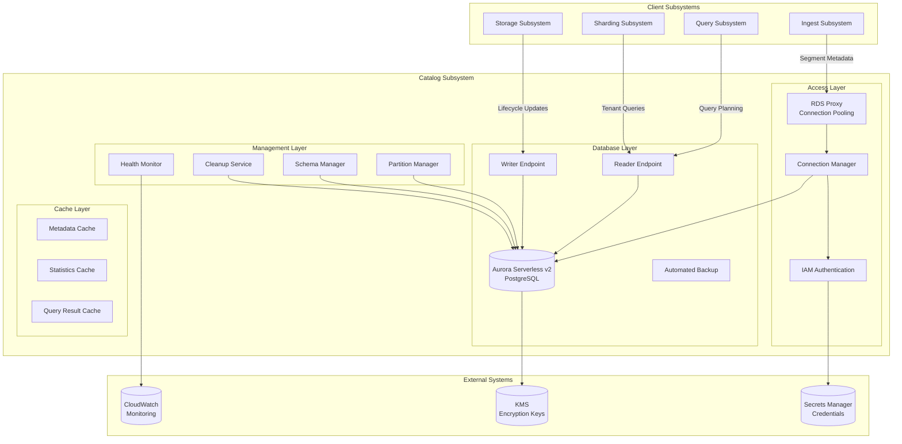
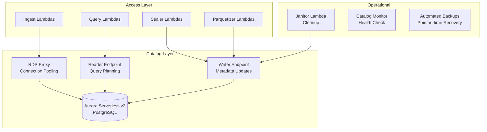

# Metadata Catalog Subsystem Design

**Aurora Serverless v2 PostgreSQL Catalog for Query Planning**

## Overview

The Metadata Catalog subsystem provides authoritative metadata storage for query planning, segment tracking, and virtual dataset management. Built on Aurora Serverless v2 PostgreSQL, it offers ACID guarantees, automatic scaling, and high availability for critical metadata operations.

## Architecture

## C4 Container Diagram



### Component Overview



### Aurora Configuration
- **Engine**: PostgreSQL 15.x
- **Mode**: Aurora Serverless v2
- **Multi-AZ**: Enabled for high availability
- **Auto Scaling**: 0.5-16 ACUs (Aurora Capacity Units)
- **Storage**: Encrypted with regional KMS keys
- **Backup**: 7-day retention with point-in-time recovery

## Database Schema

### Core Tables

#### Segments Table
The segments table serves as the authoritative registry for all data segments across the platform. It tracks segment lifecycle states (open, sealing, sealed, parquetized), time boundaries for efficient pruning, storage locations across tiers, and essential metadata for query optimization.

Key schema elements include:
- **Tenant and Dataset Identification**: Multi-tenant partitioning with dataset isolation
- **Temporal Boundaries**: Precise time ranges enabling efficient time-based queries  
- **State Management**: Lifecycle tracking through segment processing stages
- **Storage Locations**: References to EFS paths, S3 prefixes, and Parquet files
- **Optimization Metadata**: Bloom filter availability, compression ratios, schema versioning

The table uses time-based partitioning for optimal query performance and automated partition management. Monthly partitions are created automatically, and specialized indexes support common query patterns including time-range searches and state-based filtering.

```sql
-- Core segments registry table
CREATE TABLE segments (
    tenant_id       TEXT NOT NULL,
    dataset         TEXT NOT NULL,
    segment_id      TEXT NOT NULL,
    
    -- Temporal boundaries
    t_min           TIMESTAMPTZ NOT NULL,
    t_max           TIMESTAMPTZ NOT NULL,
    
    -- Segment state and lifecycle
    state           TEXT NOT NULL DEFAULT 'open', -- open, sealing, sealed, parquetized
    rows            BIGINT NOT NULL DEFAULT 0,
    size_bytes      BIGINT NOT NULL DEFAULT 0,
    
    -- Storage locations
    efs_path        TEXT,                         -- EFS hot storage path
    s3_prefix       TEXT,                         -- S3 warm storage prefix
    parquet_paths   TEXT[],                       -- S3 cold storage Parquet files
    
    -- Optimization metadata
    schema_hash     TEXT,                         -- Schema version identifier
    has_blooms      BOOLEAN DEFAULT false,       -- Bloom filter availability
    has_dicts       BOOLEAN DEFAULT true,        -- Dictionary encoding availability
    compression_ratio FLOAT,                     -- Storage compression achieved
    
    -- Lifecycle timestamps
    created_at      TIMESTAMPTZ NOT NULL DEFAULT NOW(),
    sealed_at       TIMESTAMPTZ,
    parquetized_at  TIMESTAMPTZ,
    
    -- Manifest versioning
    manifest_version INTEGER NOT NULL DEFAULT 1,
    
    PRIMARY KEY (tenant_id, dataset, segment_id)
) PARTITION BY RANGE (t_min);

-- Monthly partitions for segments table
CREATE TABLE segments_2024_01 PARTITION OF segments
    FOR VALUES FROM ('2024-01-01 00:00:00+00') TO ('2024-02-01 00:00:00+00');

-- Indexes for common query patterns
CREATE INDEX idx_segments_time_state ON segments (tenant_id, dataset, t_min, t_max, state);
CREATE INDEX idx_segments_lifecycle ON segments (tenant_id, dataset, state, created_at);
CREATE INDEX idx_segments_size ON segments (tenant_id, dataset, size_bytes DESC);
```

#### Block Statistics Table
```sql
-- Per-block statistics for query pruning
CREATE TABLE block_stats (
    tenant_id       TEXT NOT NULL,
    dataset         TEXT NOT NULL,
    segment_id      TEXT NOT NULL,
    column_name     TEXT NOT NULL,
    block_id        TEXT NOT NULL,
    
    -- Basic statistics
    row_count       INTEGER NOT NULL,
    null_count      INTEGER NOT NULL,
    distinct_count  INTEGER,
    
    -- Min/max values for pruning
    minmax          JSONB NOT NULL,
    
    -- Top-K values for dictionary pruning
    topk            JSONB,
    
    -- Bloom filter for membership testing
    bloom           BYTEA,
    bloom_hash_funcs INTEGER,
    bloom_fpp       FLOAT,
    
    -- Block metadata
    size_bytes      INTEGER NOT NULL,
    compression     TEXT DEFAULT 'zstd',
    encoding        TEXT NOT NULL,
    
    created_at      TIMESTAMPTZ NOT NULL DEFAULT NOW(),
    
    PRIMARY KEY (tenant_id, dataset, segment_id, column_name, block_id)
);

-- Indexes for pruning queries
CREATE INDEX idx_block_stats_segment ON block_stats (tenant_id, dataset, segment_id);
CREATE INDEX idx_block_stats_column ON block_stats (tenant_id, dataset, column_name);
CREATE INDEX idx_block_stats_minmax ON block_stats USING GIN (minmax);
```

#### Trace Hints Table
```sql
-- Fast trace lookups by trace ID
CREATE TABLE trace_hints (
    tenant_id       TEXT NOT NULL,
    dataset         TEXT NOT NULL, 
    trace_id        BYTEA NOT NULL,        -- 16-byte trace ID
    hour            TIMESTAMPTZ NOT NULL,   -- Hour bucket for partitioning
    
    -- Location information
    locations       JSONB NOT NULL,        -- Segment/block locations
    span_count      INTEGER,
    service_names   TEXT[],
    
    -- TTL for cleanup
    expires_at      TIMESTAMPTZ NOT NULL,
    created_at      TIMESTAMPTZ NOT NULL DEFAULT NOW(),
    
    PRIMARY KEY (tenant_id, dataset, trace_id, hour)
) PARTITION BY RANGE (hour);

-- Partitions for trace hints (shorter retention)
CREATE TABLE trace_hints_2024_01_15 PARTITION OF trace_hints
    FOR VALUES FROM ('2024-01-15 00:00:00+00') TO ('2024-01-16 00:00:00+00');

-- Indexes for trace lookups
CREATE INDEX idx_trace_hints_id ON trace_hints (tenant_id, dataset, trace_id);
CREATE INDEX idx_trace_hints_expires ON trace_hints (expires_at);
```

#### Virtual Datasets
```sql
-- Virtual dataset containers
CREATE TABLE virtual_containers (
    tenant_id       TEXT NOT NULL,
    name            TEXT NOT NULL,
    description     TEXT,
    created_at      TIMESTAMPTZ NOT NULL DEFAULT NOW(),
    updated_at      TIMESTAMPTZ NOT NULL DEFAULT NOW(),
    
    PRIMARY KEY (tenant_id, name)
);

-- Virtual dataset membership
CREATE TABLE virtual_members (
    tenant_id       TEXT NOT NULL,
    container_name  TEXT NOT NULL,
    dataset         TEXT NOT NULL,
    added_at        TIMESTAMPTZ NOT NULL DEFAULT NOW(),
    
    PRIMARY KEY (tenant_id, container_name, dataset),
    FOREIGN KEY (tenant_id, container_name) 
        REFERENCES virtual_containers(tenant_id, name) ON DELETE CASCADE
);

-- Index for container resolution
CREATE INDEX idx_virtual_members_container ON virtual_members (tenant_id, container_name);
```

### Schema Evolution Support

#### Schema Registry
```sql
-- Track schema evolution over time
CREATE TABLE dataset_schemas (
    tenant_id       TEXT NOT NULL,
    dataset         TEXT NOT NULL,
    schema_version  INTEGER NOT NULL,
    schema_hash     TEXT NOT NULL,
    
    -- Schema definition
    columns         JSONB NOT NULL,        -- Column definitions
    partitioning    JSONB,                 -- Partitioning scheme
    
    -- Metadata
    first_seen      TIMESTAMPTZ NOT NULL DEFAULT NOW(),
    last_seen       TIMESTAMPTZ NOT NULL DEFAULT NOW(),
    segment_count   INTEGER DEFAULT 0,
    
    PRIMARY KEY (tenant_id, dataset, schema_version)
);

-- Index for latest schema lookup
CREATE INDEX idx_dataset_schemas_latest ON dataset_schemas (tenant_id, dataset, last_seen DESC);
```

## Catalog Operations

### Segment Management

#### Segment Creation and Updates

The catalog subsystem provides comprehensive segment lifecycle management through atomic database operations that ensure consistency between storage tiers and metadata records. Segment operations support the complete lifecycle from creation through parquetization while maintaining accurate metadata for query planning.

**Segment Registration Process**: When the ingest subsystem creates new segments, it registers them in the catalog with initial metadata including tenant identification, temporal boundaries, storage locations, and optimization characteristics. The registration process uses atomic upsert operations that handle both new segment creation and updates to existing segments as they accumulate data.

**Lifecycle State Management**: Segment state transitions are managed through atomic database updates that coordinate with storage tier operations. State changes from 'open' to 'sealing' to 'sealed' to 'parquetized' are tracked with appropriate timestamps, enabling accurate lifecycle monitoring and query planning decisions.

**Storage Location Tracking**: The catalog maintains authoritative records of segment storage locations across all tiers. EFS paths for hot storage, S3 prefixes for warm storage, and Parquet file paths for cold storage are updated atomically during lifecycle transitions, ensuring that query operations can locate data regardless of storage tier.

**Metadata Versioning**: Each segment maintains a manifest version that increments with updates, enabling consistent views of segment contents during concurrent operations. Version tracking supports optimistic concurrency control and helps coordinate operations across multiple subsystems.

#### Block Statistics Management

The catalog subsystem maintains comprehensive block-level statistics that enable sophisticated query optimization through fine-grained pruning and cost estimation. Block statistics capture essential characteristics of columnar data that support efficient query planning across both hot and cold storage tiers.

**Statistical Data Collection**: Each columnar block generates comprehensive statistics during the encoding process, including row counts, null counts, distinct value estimates, and min/max ranges. These statistics are collected automatically during data ingestion and stored in the catalog for subsequent query optimization.

**Batch Statistics Processing**: Block statistics are processed in batches to optimize database performance during high-throughput ingestion scenarios. Batch processing reduces catalog database load while ensuring that statistics remain current for query planning operations.

**Query Pruning Support**: The statistics system provides fast access to block-level metadata that enables query planners to eliminate blocks that cannot contain relevant data. Min/max range pruning, null count analysis, and Bloom filter membership testing combine to minimize data scanning requirements.

**Advanced Optimization Metadata**: Beyond basic statistics, the system tracks frequency information through top-K value collections and provides optional Bloom filters for high-cardinality columns. This advanced metadata enables sophisticated optimization strategies for complex analytical queries.

### Query Planning Support

#### Segment Discovery and Query Planning

The catalog subsystem provides sophisticated query planning support through efficient segment discovery and cost estimation capabilities. These services enable the Arrow Flight SQL server to make intelligent decisions about data access patterns and optimize query execution across storage tiers.

**Time-Based Segment Selection**: Query planning begins with identifying segments that overlap the requested time range, leveraging the temporal partitioning of the segments table for efficient lookups. The system performs interval intersection calculations to identify all segments that might contain relevant data, considering both exact overlaps and partial intersections.

**Storage Tier Coordination**: Segment discovery returns comprehensive metadata about storage locations across tiers, enabling the query engine to coordinate access to hot EFS data, warm S3 segments, and cold Parquet files. State information indicates data availability and access patterns for optimal query routing.

**Cost-Based Optimization**: The catalog provides detailed cost estimation services that analyze segment counts, row volumes, storage sizes, and block-level statistics to inform query optimization decisions. Cost estimates consider both computational complexity and I/O requirements across different storage tiers.

**Pruning Strategy Support**: Query planning leverages block-level statistics to enable aggressive pruning before data access begins. Min/max range analysis, Bloom filter membership testing, and null count optimization combine to minimize the data that must be scanned for query execution.

### Trace Hints Management

#### Trace Location Indexing

The catalog subsystem maintains specialized trace hint tables that enable rapid trace retrieval by providing fast lookup capabilities for distributed trace data scattered across multiple segments and storage tiers. This indexing system supports the Zipkin-compatible query APIs with sub-second trace retrieval performance.

**Trace Location Caching**: The system maintains hour-based trace location hints that capture where specific trace IDs can be found across segments and storage tiers. These hints are generated during data ingestion and updated as segments transition between storage tiers, providing authoritative location information for query operations.

**Time-Bounded Hint Storage**: Trace hints utilize time-based partitioning aligned with hour boundaries to optimize lookup performance and support efficient cleanup of expired hints. The partitioning strategy balances lookup speed with storage efficiency, maintaining hints for frequently accessed time windows while automatically expiring older data.

**Batch Hint Processing**: Trace hint updates are processed in batches during segment commits to optimize catalog performance during high-throughput ingestion. Batch processing reduces database transaction overhead while ensuring that trace location information remains current for query operations.

**Automatic Cleanup and TTL Management**: The system automatically manages trace hint lifecycle through configurable TTL policies that balance trace lookup performance with storage efficiency. Expired hints are removed through automated cleanup processes that maintain optimal catalog performance.

### Virtual Dataset Management

#### Virtual Dataset Container Management

The catalog subsystem supports virtual dataset containers that enable logical grouping of related datasets for simplified query operations and organizational purposes. Virtual containers provide a transparent abstraction layer that allows queries to span multiple datasets through a single identifier.

**Container Creation and Management**: Virtual containers are created with descriptive metadata and initial dataset membership that can be modified over time. Container operations use transactional semantics to ensure consistency between container definitions and membership records, preventing orphaned references or inconsistent states.

**Dataset Resolution Services**: The catalog provides efficient resolution services that translate virtual container names to lists of actual datasets during query planning. Resolution operations support both direct dataset references and virtual container expansion, enabling transparent query execution across logical dataset groupings.

**Dynamic Membership Management**: Virtual containers support dynamic dataset membership changes through atomic operations that maintain referential integrity. Membership updates are timestamped to support temporal queries and audit trails for container evolution over time.

**Query Integration**: Virtual dataset containers integrate seamlessly with query planning operations, expanding automatically during segment discovery and cost estimation phases. The expansion process is optimized to minimize query planning overhead while supporting complex analytical queries across multiple datasets.

## Connection Management

### RDS Proxy and Connection Architecture

The catalog subsystem utilizes RDS Proxy for efficient connection management and high availability access to Aurora Serverless clusters. The proxy configuration optimizes connection pooling for Lambda workloads while providing transparent failover capabilities.

#### Connection Pool Management

**Reader/Writer Separation**: The system maintains separate connection pools for read and write operations, enabling optimal load distribution and query routing. Read operations utilize Aurora reader endpoints for improved performance, while write operations target the writer endpoint for consistency.

**Lambda Optimization**: Connection pools are sized and configured specifically for Lambda execution patterns, with appropriate timeout settings and initialization strategies that minimize cold start impact. Pool management considers the ephemeral nature of Lambda functions while maintaining efficient resource utilization.

**IAM Integration**: Database connections utilize IAM authentication with automatic token refresh, eliminating the need for stored database credentials. IAM integration provides fine-grained access control aligned with Lambda execution roles and security policies.

## Performance Optimization

### Query Optimization Strategies

The catalog database employs sophisticated indexing and query optimization strategies that support high-performance metadata operations at scale.

**Temporal Indexing**: Specialized indexes on temporal columns enable efficient time-range queries that support query planning operations. Partial indexes on active segments optimize common lookup patterns while minimizing index maintenance overhead.

**Statistics-Based Optimization**: The system maintains comprehensive statistics on query patterns and data distributions, enabling the query optimizer to make intelligent decisions about join strategies and index utilization.

**Concurrent Access Patterns**: Index design considers concurrent read/write patterns typical of high-throughput telemetry ingestion, with strategies that minimize lock contention while maintaining consistency.

### Partition Management Architecture

**Automated Partition Creation**: The system automatically creates monthly partitions for time-series tables, ensuring optimal query performance as data volumes grow. Partition creation occurs proactively to prevent service disruptions during partition boundary transitions.

**Partition Pruning Optimization**: Query planning leverages PostgreSQL's partition pruning capabilities to eliminate irrelevant partitions during time-range queries. This optimization dramatically improves query performance for analytical workloads spanning large time ranges.

**Lifecycle Management**: Automated partition management includes cleanup procedures that remove old partitions according to retention policies. Cleanup operations coordinate with data lifecycle management to ensure consistency across storage tiers.
