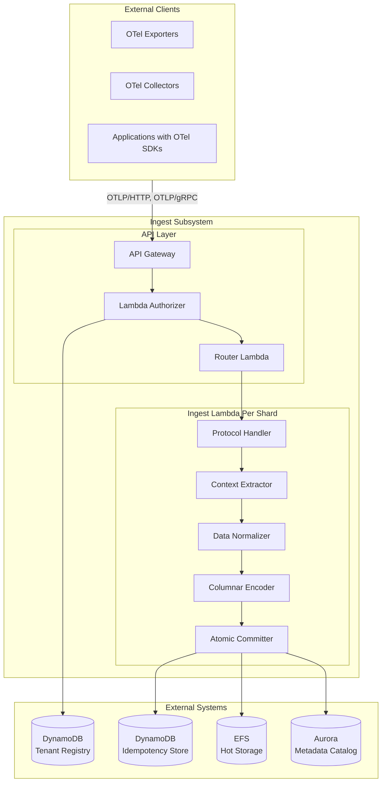
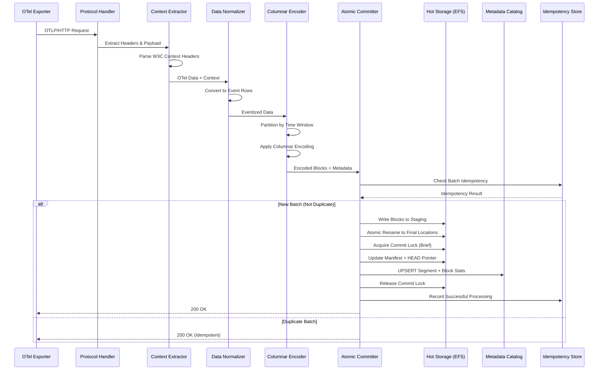
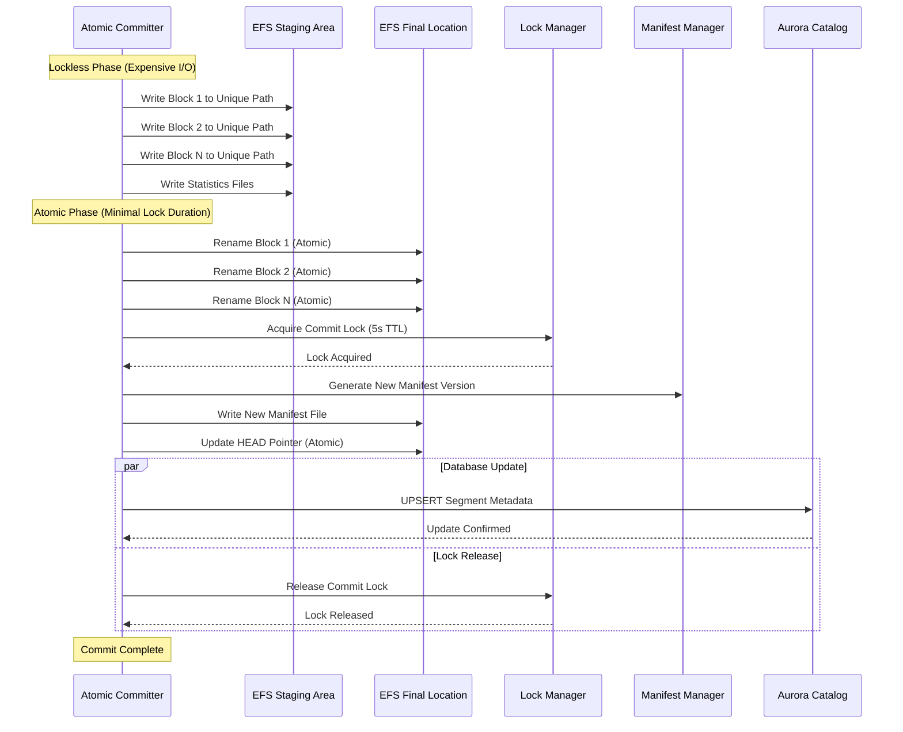

# Ingest Subsystem Design

**OTel Data Ingestion Service**

## Overview

The Ingest subsystem handles high-throughput ingestion of OpenTelemetry data (logs, traces, metrics) with low latency and atomic guarantees. It transforms OTLP data into columnar format and commits it to the hot storage layer with proper isolation and consistency.

## Architecture

## C4 Container Diagram



### Component Responsibilities

#### Ingest Lambda (Per Shard)
- **Purpose**: Primary ingestion endpoint for OTLP data
- **Scaling**: Per-shard deployment with reserved concurrency
- **Runtime**: Python 3.11+ on ARM64 (Graviton) for cost/performance
- **Memory**: 2-4 GB to unlock network throughput and faster compression

#### Processing Pipeline
1. **Protocol Handling**: OTLP/HTTP (primary), OTLP/gRPC support
2. **Context Extraction**: W3C baggage, tracestate, traceparent headers
3. **Data Normalization**: OTel → eventized rows with common schema
4. **Columnar Encoding**: Delta compression, dictionary encoding, RLE
5. **Atomic Commit**: EFS with NFS symlink locking

## Data Flow

### Request Processing Sequence



### Atomic Commit Protocol Sequence



### Data Transformation

#### OpenTelemetry Signal Transformation

The ingest system implements comprehensive transformation logic that converts OpenTelemetry protocol buffers into the platform's unified columnar schema while preserving complete signal fidelity.

**Span Processing**: Each incoming span is transformed into one or more rows depending on its complexity. The primary span row contains core timing information including start and end timestamps, duration calculations, operation names, and status codes. Span attributes are flattened into individual columns with systematic naming conventions that preserve the original attribute hierarchy.

Span events are processed as separate rows that reference the parent span through span_id linkage. This approach enables efficient querying of both span-level and event-level information while maintaining clear relationships. Link information from spans is preserved in dedicated columns that reference related trace and span identifiers.

**Log Record Processing**: Log records undergo transformation that preserves both structured and unstructured log data. The log body is stored as a searchable text column, while severity levels are normalized to standard numeric values for efficient filtering and alerting. Log attributes are systematically flattened using consistent naming patterns.

Contextual information including trace correlation data is extracted and stored in dedicated trace context columns when present. This enables seamless correlation between log records and distributed traces for comprehensive observability analysis.

**Metric Data Processing**: Metric processing handles the diverse range of OpenTelemetry metric types through specialized transformation logic. Gauge metrics become direct row representations with measurement values and associated metadata. Counter metrics are processed similarly while preserving cumulative semantics through appropriate column representations.

Histogram metrics require more complex processing where individual bucket data is expanded into multiple rows, each representing a specific bucket boundary and count value. Summary statistics and exemplar data are preserved as additional columns to maintain complete metric fidelity for analytical queries.

#### Context and Baggage Handling

The system preserves distributed tracing context through W3C standard headers:

- **Traceparent**: Maintains trace correlation across service boundaries
- **Tracestate**: Preserves vendor-specific trace state information
- **Baggage**: Captures key-value pairs that propagate across trace spans

Baggage items are extracted and stored as flattened columns with "ctx.baggage." prefixes, enabling efficient querying of distributed context information.

## Storage Integration

### EFS Columnar Layout

The ingest system writes data to EFS using a columnar storage format optimized for analytics workloads. Data is organized into time-based segments (typically 5-minute windows) with each segment containing multiple columnar blocks.

#### Segment Structure
```
/efs/tenants/<tenant>/datasets/<dataset>/
  segments/<segment_id>/                  # 5-min window
    .lock → lease-<uuid>@<expires>       # Segment-level lease
    .commit (lockfile)                   # Short commit lock
    .seal (lockfile)                     # Sealing operation lock
    manifest/                            # Manifest versions
    HEAD → manifest/latest.json          # Current manifest pointer
    columns/                             # Column data
      tenant_id/blocks/                  # Column blocks
      timestamp/blocks/
      trace_id/blocks/
      tenant_id/stats/                   # Per-block statistics
      tenant_id/dict/                    # Dictionary encodings
    _segment.meta                        # Segment metadata
```

#### Block Encoding Strategies

The system employs adaptive encoding strategies based on column characteristics:

**Timestamps (Delta-of-Delta)**: Leverages the typically monotonic nature of timestamps by encoding the difference between consecutive deltas, achieving high compression ratios for time-series data.

**Strings (Dictionary + RLE)**: Creates frequency-ordered dictionaries for string columns, then applies run-length encoding when beneficial. This approach is particularly effective for columns with moderate cardinality like service names.

**Numbers (Adaptive)**: Chooses encoding based on data patterns - delta encoding for monotonic sequences, bit packing for small integers, and dictionary encoding for low-cardinality numeric data.

### Atomic Operations and Locking

#### NFS Symlink Locking

The system uses NFS symlink creation as an atomic locking mechanism. Symlink targets encode lease information including expiration timestamps, enabling automatic cleanup of stale locks. This approach provides the atomicity guarantees needed for concurrent writers while minimizing lock contention.

#### Lockless Staging

To minimize the critical section protected by locks, the system uses a lockless staging approach:

1. **Stage**: Writers create uniquely named files in staging directories
2. **Rename**: Atomic rename operations move staged files to final locations
3. **Commit**: Brief lock acquisition updates manifests and HEAD pointers

This design ensures that the expensive I/O operations happen outside of critical sections.

#### Manifest Management

Segment manifests track the complete set of blocks within each segment. The system uses versioned manifests with atomic HEAD pointer updates to ensure consistent views of segment contents. Each manifest includes block references, statistics summaries, and schema information.

### Idempotency Guarantees

#### Duplicate Detection

The system protects against duplicate ingestion through deterministic batch key generation and DynamoDB conditional writes. Batch keys incorporate tenant identity, temporal information, and content hashes to ensure uniqueness while allowing legitimate retries.

#### Consistency Windows

Idempotency tracking uses configurable time windows that balance protection against duplicates with operational efficiency. Keys automatically expire after the idempotency window, preventing indefinite storage growth.

## Performance Optimizations

### Batching and Buffering

#### Request Batching
- **Optimal Size**: 2-16k records per request for balanced throughput and latency
- **Payload Size**: 256KB-4MB range balances Lambda efficiency with network overhead
- **Protocol Preference**: OTLP/HTTP with protobuf for optimal compression

#### Internal Buffering
The system maintains internal buffers that accumulate incoming data until flushing thresholds are reached. Buffers flush based on row count limits, time-based intervals, or memory pressure, ensuring predictable latency characteristics.

### Compression and Encoding

#### Adaptive Encoding Selection
The system analyzes column characteristics in real-time to select optimal encoding strategies. Monotonic sequences trigger delta encoding, low-cardinality data uses dictionary compression, and high-entropy data falls back to general-purpose compression.

#### Compression Configuration
- **Algorithm**: Zstd levels 1-3 optimize for hot path performance
- **Dictionaries**: Pre-trained compression dictionaries per tenant/dataset pair
- **Block Sizing**: Target 2-4 MB blocks for optimal I/O characteristics

### Memory and CPU Optimization

#### Lambda Configuration
- **Architecture**: ARM64 Graviton processors provide superior price/performance
- **Memory**: 2-4 GB allocations unlock enhanced network throughput
- **Provisioned Concurrency**: Eliminates cold starts for hot ingestion paths
- **Concurrency Limits**: Per-shard reserved concurrency prevents tenant impact

#### Processing Optimizations
- **Vectorization**: Columnar processing maximizes CPU cache efficiency
- **Parallel Encoding**: Multi-threaded compression for large batches
- **Memory Layout**: Arrow-compatible layouts minimize data copying

## Error Handling and Reliability

### Retry Logic

The system categorizes errors to determine appropriate retry behavior:

- **Client Errors**: Invalid OTLP format or authentication failures result in immediate rejection
- **Throttling Errors**: EFS or Lambda throttling triggers exponential backoff retries
- **Transient Errors**: Infrastructure issues allow retries with jittered delays

### Partial Failure Handling

#### Segment Recovery
The system includes recovery mechanisms for various failure scenarios including incomplete writes, orphaned staging files, and manifest corruption. Recovery procedures run automatically during Lambda initialization and periodically via maintenance functions.

#### Lock Timeout Handling
Stale locks are automatically cleaned up based on embedded expiration timestamps. The system uses jittered retry logic to handle lock contention gracefully, with fallback mechanisms for persistent failures.

### Monitoring and Observability

#### Metrics Emission
The system emits comprehensive metrics including throughput rates, processing latency distributions, error classifications, and resource utilization patterns. Metrics are tagged with tenant and dataset identifiers for detailed analysis.

#### Structured Logging
All operations generate structured logs with consistent formatting and correlation identifiers. Logs include tenant context for security auditing while omitting sensitive data content.

## Configuration and Deployment

### Environment Configuration

The ingest system supports configurable parameters for performance tuning including batch size limits, compression levels, segment window durations, and lock timeout values. Configuration supports per-tenant overrides for specialized requirements.

### Lambda Deployment

Ingest Lambdas deploy with optimized configurations including ARM64 architecture selection, environment variable encryption, EFS filesystem mounting, and appropriate IAM permissions for multi-service access.

