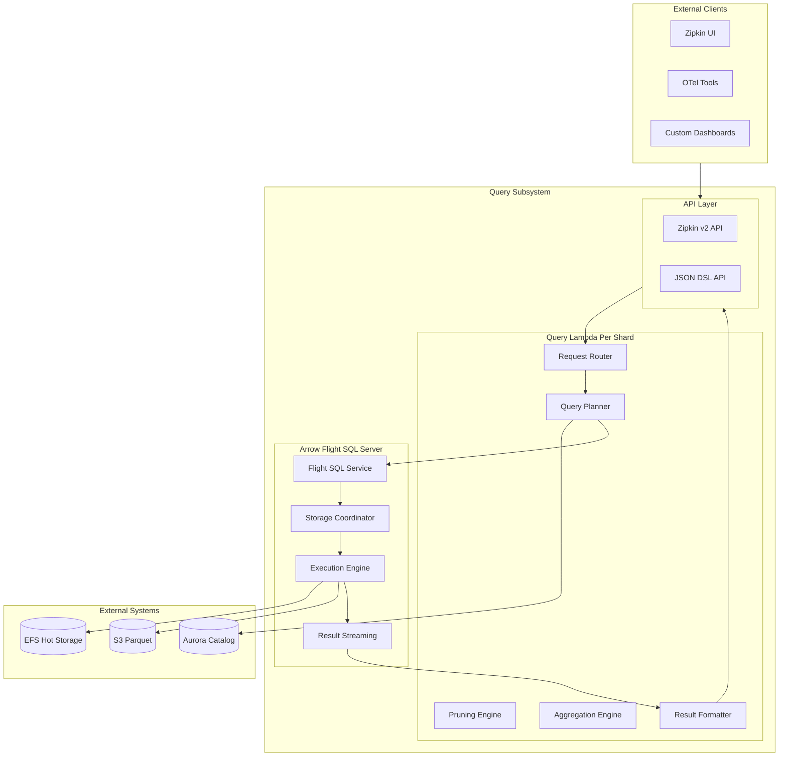
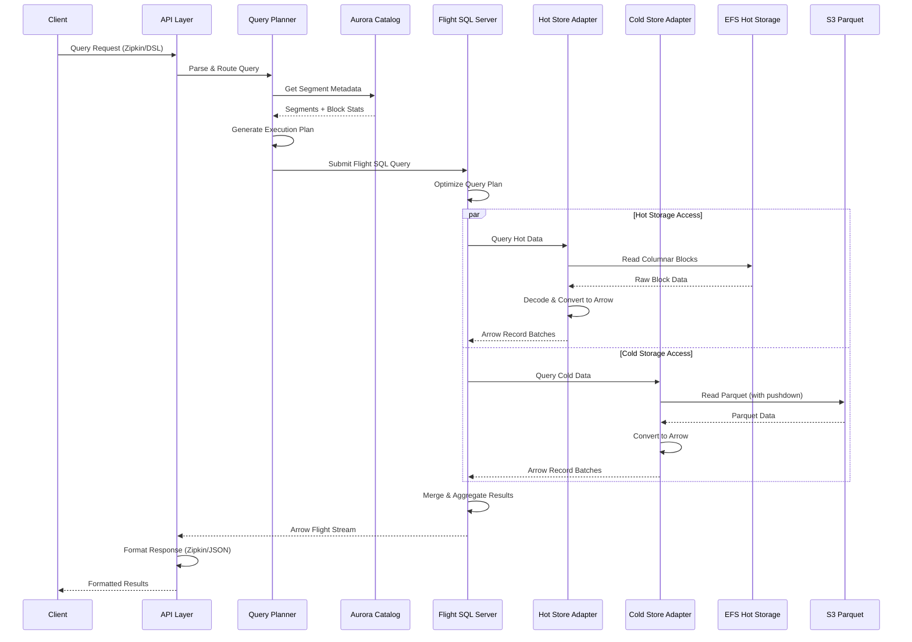

# Query Subsystem Design

**Serverless Query Engine with Arrow Flight SQL**

## Overview

The Query subsystem provides a serverless analytics engine that efficiently processes queries across hot (EFS) and cold (Parquet) storage tiers using Apache Arrow Flight SQL. It implements Zipkin-compatible APIs and a custom JSON DSL, with Aurora-assisted query planning and vectorized execution.

## Arrow Flight SQL Server Implementation

The Query subsystem implements a dedicated Arrow Flight SQL server component that acts as the primary interface for all data access operations. This server provides a unified SQL abstraction layer over the heterogeneous storage tiers while leveraging Arrow's high-performance columnar processing capabilities.

The Flight SQL server handles query planning, storage tier coordination, and result streaming through a standard SQL interface. Clients interact exclusively with the Flight SQL server, which internally manages the complexities of reading from EFS columnar blocks and S3 Parquet files. This abstraction enables sophisticated query optimization while presenting a familiar SQL interface to applications.

The server implementation utilizes Arrow's columnar memory format throughout the query execution pipeline, enabling efficient SIMD operations and minimizing data copying between processing stages. Query results are streamed as Arrow Flight batches, supporting large result sets without memory pressure on either client or server.

## Architecture

## C4 Container Diagram



### Arrow Flight SQL Server Components

The Arrow Flight SQL server comprises several interconnected components that work together to provide comprehensive query processing capabilities across storage tiers.

#### Flight SQL Service
The Flight SQL Service implements the standard Arrow Flight SQL protocol, exposing gRPC endpoints for query submission, plan retrieval, and result streaming. This service handles client authentication, query parsing, and protocol-level operations while maintaining compatibility with standard Arrow Flight SQL clients.

The service translates incoming SQL queries into internal execution plans that can operate across multiple storage tiers. It manages client sessions, tracks query execution state, and coordinates result delivery through Arrow Flight streams.

#### Storage Coordinator
The Storage Coordinator manages access to both hot EFS storage and cold S3 Parquet storage, presenting a unified view of data regardless of storage tier. This component determines which storage systems contain relevant data for a given query based on time ranges, segment states, and metadata from the Aurora catalog.

The coordinator implements intelligent caching strategies for frequently accessed metadata and optimizes data access patterns by coordinating parallel reads from multiple storage systems. It handles storage tier transitions transparently, ensuring consistent query results even as data moves between tiers.

#### Execution Engine
The Execution Engine performs the actual query processing using Arrow's vectorized compute functions. This engine reads data from storage systems, applies filters and transformations, and generates result sets using efficient columnar operations.

The engine implements sophisticated optimization strategies including predicate pushdown to storage layers, column pruning to minimize I/O, and vectorized aggregations for high-performance analytics. It coordinates parallel execution across multiple data segments while managing memory usage and resource allocation.

### Lambda Configuration
- **Runtime**: Python 3.11+ on ARM64 (Graviton) with PyArrow native extensions
- **Memory**: 3-10 GB based on workload (larger for analytics requiring more Arrow buffers)
- **Timeout**: 15 minutes for complex queries
- **Provisioned Concurrency**: Hot paths to eliminate cold starts
- **Reserved Concurrency**: Per-shard limits for isolation

## API Interfaces

### Zipkin v2 Compatibility

The query engine maintains full compatibility with Zipkin v2 APIs, translating Zipkin requests to internal Arrow Flight SQL queries:

#### Trace Retrieval
- **GET /zipkin/api/v2/trace/{traceId}**: Returns complete trace as Zipkin span array
- **GET /zipkin/api/v2/traces**: Search traces with filters (service, operation, duration, tags)

The system uses trace hints stored in Aurora to quickly locate trace data across segments, then executes optimized Arrow Flight SQL queries to retrieve span data from both hot EFS blocks and cold Parquet files.

#### Service Discovery
- **GET /zipkin/api/v2/services**: Returns list of service names from metadata aggregates
- **GET /zipkin/api/v2/spans**: Returns span names for a given service
- **GET /zipkin/api/v2/dependencies**: Analyzes service call patterns and error rates

### JSON DSL API

The custom DSL provides advanced analytics capabilities beyond Zipkin's scope. Query structure supports:

- **Dataset Selection**: Target specific datasets or virtual containers
- **Signal Types**: Query spans, logs, or metrics independently
- **Time Windows**: Precise time range specification with timezone support
- **Column Projection**: Select specific attributes and computed fields
- **Filter Predicates**: Complex WHERE clauses with multiple operators
- **Grouping and Aggregation**: GROUP BY with various aggregation functions
- **Result Limiting**: Pagination and result set size controls

Example query targeting service performance analysis:
```json
{
  "dataset": "prod-tracing",
  "signal": "spans",
  "time": {"from": "2024-01-15T12:00Z", "to": "2024-01-15T13:00Z"},
  "select": ["service_name", "name", "duration_ms"],
  "where": [
    {"col": "service_name", "op": "=", "val": "checkout"},
    {"col": "duration_ms", "op": ">", "val": 100}
  ],
  "group_by": ["service_name", "name"],
  "agg": [{"fn": "count"}, {"fn": "p", "col": "duration_ms", "q": [50, 95, 99]}]
}
```

### API Translation Layer

The Query subsystem provides a translation layer that converts both Zipkin API requests and JSON DSL queries into appropriate Arrow Flight SQL statements. This translation process enables the system to leverage the Flight SQL server's optimization capabilities while maintaining API compatibility with existing tools.

**Zipkin API Translation**: Zipkin trace retrieval requests are translated into SQL queries that join span data across time windows and storage tiers. The translation layer generates efficient WHERE clauses based on trace IDs, service names, and time ranges, then coordinates result assembly to match Zipkin's expected JSON format.

**DSL Query Translation**: The JSON DSL provides more direct access to SQL capabilities, with DSL constructs mapping closely to SQL operations. Complex aggregations, grouping operations, and filter predicates are translated into corresponding SQL statements that can be optimized by the Flight SQL server.

The DSL queries are translated into Arrow Flight SQL statements that execute efficiently across the tiered storage architecture, taking advantage of the server's cross-tier optimization capabilities.

## Query Planning and Execution

### Aurora-Assisted Planning

The query planner uses Aurora's metadata catalog to make intelligent decisions about data access patterns. The planning process involves several stages:

1. **Segment Discovery**: Aurora catalog is queried for segments that overlap the requested time range and match dataset criteria. This initial filtering eliminates large portions of irrelevant data.

2. **Block-Level Pruning**: For each candidate segment, the planner examines block-level statistics including min/max values, null counts, and distinct value counts. Blocks that cannot satisfy filter predicates are eliminated.

3. **Bloom Filter Pruning**: High-cardinality columns like trace_id and service_name utilize Bloom filters for membership testing. This provides fast elimination of blocks that definitely don't contain matching values.

4. **Cost Estimation**: The planner calculates estimated processing costs including bytes to scan, network transfer requirements, and expected processing time.

The final query plan specifies which Arrow Flight SQL queries to execute against hot EFS storage versus cold Parquet storage, optimizing for both performance and cost.

### Hybrid Execution Model

#### Query Execution Sequence



The execution engine coordinates parallel access to both storage tiers. Hot storage queries access recent data from EFS-based columnar blocks, while cold storage queries read historical data from Parquet files in S3. Results from both tiers are merged and aggregated using Arrow's vectorized operations.

### Arrow Flight SQL Execution

#### Hot Storage (EFS) Processing
Hot storage queries read columnar blocks from EFS using memory-mapped access patterns that minimize I/O overhead. The system decodes compressed blocks (using delta encoding and dictionary compression) directly into Arrow arrays, then applies vectorized filters and projections using Arrow compute kernels. Results stream as Arrow record batches to downstream processing.

#### Cold Storage (Parquet) Processing  
Cold storage queries leverage Parquet's built-in optimization features including predicate pushdown and column pruning. The system reads only necessary row groups based on metadata, applies Bloom filter pruning at the Parquet level, and utilizes Parquet's native Arrow integration for zero-copy data access.

### Fan-Out for Large Queries

Complex queries spanning large data volumes use AWS Step Functions to coordinate distributed execution across multiple Lambda invocations. The system detects queries estimated to scan more than 4GB or process more than 200 segments, then automatically partitions the work. Partial results are combined using Arrow Flight's streaming capabilities, enabling processing of datasets larger than individual Lambda memory limits.

## Aggregation Engine

### Vectorized Aggregations

The aggregation engine leverages Arrow's vectorized compute functions for high-performance analytics. Basic aggregations (count, sum, average, min, max) use SIMD-optimized operations that process multiple values simultaneously. Advanced aggregations include T-digest algorithms for approximate percentiles, HyperLogLog for distinct counting, and custom time-series functions for temporal analysis.

### Memory-Efficient Processing

Large aggregations use Arrow's streaming processing capabilities to maintain consistent memory usage regardless of result set size. The system computes partial aggregates per Arrow batch, spills large intermediate results to EFS when needed, and streams final results to clients without full materialization.

## Result Formatting

### Zipkin Format Output

Trace results are formatted according to Zipkin v2 specifications while maintaining full fidelity of the original telemetry data. The system converts internal span representations to Zipkin format, preserves nanosecond timestamp precision, maps OTel attributes to Zipkin tags, and computes service dependency graphs from parent-child relationships.

### DSL JSON Format

Analytics results include comprehensive metadata about query execution including original query parameters, performance metrics (bytes scanned, processing time, cache hit ratios), data lineage information, and result schema details.

### Arrow Flight Streaming

For large result sets, clients can consume results as Arrow Flight streams. This enables chunked transfer using Arrow record batches, dynamic schema handling for heterogeneous data, and optional compression for network efficiency.

## Performance Optimizations

### Caching Strategy

The query engine employs multiple caching layers to improve performance:

- **Metadata Caching**: Block statistics, dictionary data, and schema information are cached in Lambda memory for repeated queries
- **Result Caching**: Historical query results (for queries >1 hour old) are cached in ElastiCache with appropriate TTL policies
- **Trace Hints**: Frequently accessed trace locations are cached for sub-second trace retrieval

### Vectorized Processing

All data processing uses Arrow's vectorized operations including vectorized filter predicates, batch type conversions, and vectorized string operations. This provides significant performance improvements over row-by-row processing, especially for large datasets.

### Memory Management

The system uses Arrow's sophisticated memory management including reusable memory pools, zero-copy operations between processing stages, and fixed-size batch processing to prevent memory exhaustion during large query execution.

## Error Handling and Reliability

### Query Timeout Management

Long-running queries are managed through progressive timeout strategies that increase based on query complexity. Large queries support checkpoint/resume functionality, and resource limits prevent individual queries from consuming excessive Lambda resources.

### Fault Tolerance

The query engine handles various failure scenarios gracefully. Partial failures continue processing available data when some segments are inaccessible, transient errors trigger automatic retries with exponential backoff, and the system can return partial results with appropriate warnings when complete execution isn't possible.

### Monitoring and Observability

Comprehensive monitoring covers query performance metrics, resource utilization patterns, error categorization, and cache effectiveness measurements. This enables continuous optimization of query performance and early detection of potential issues.

