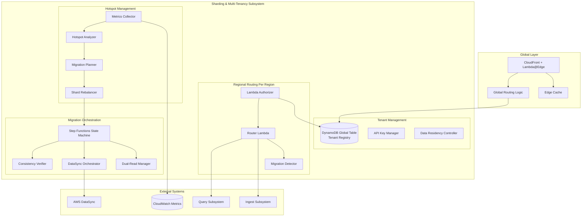
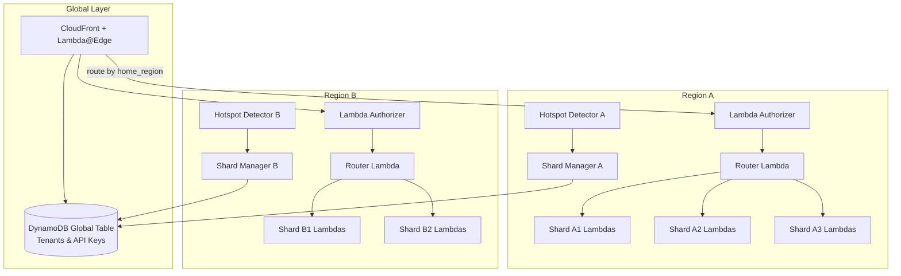
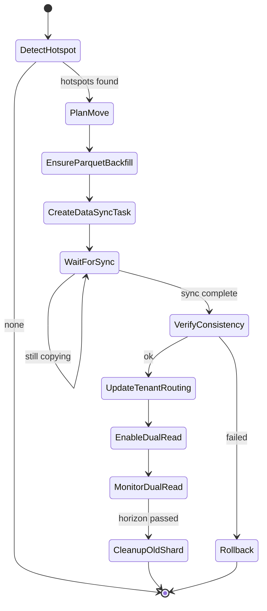
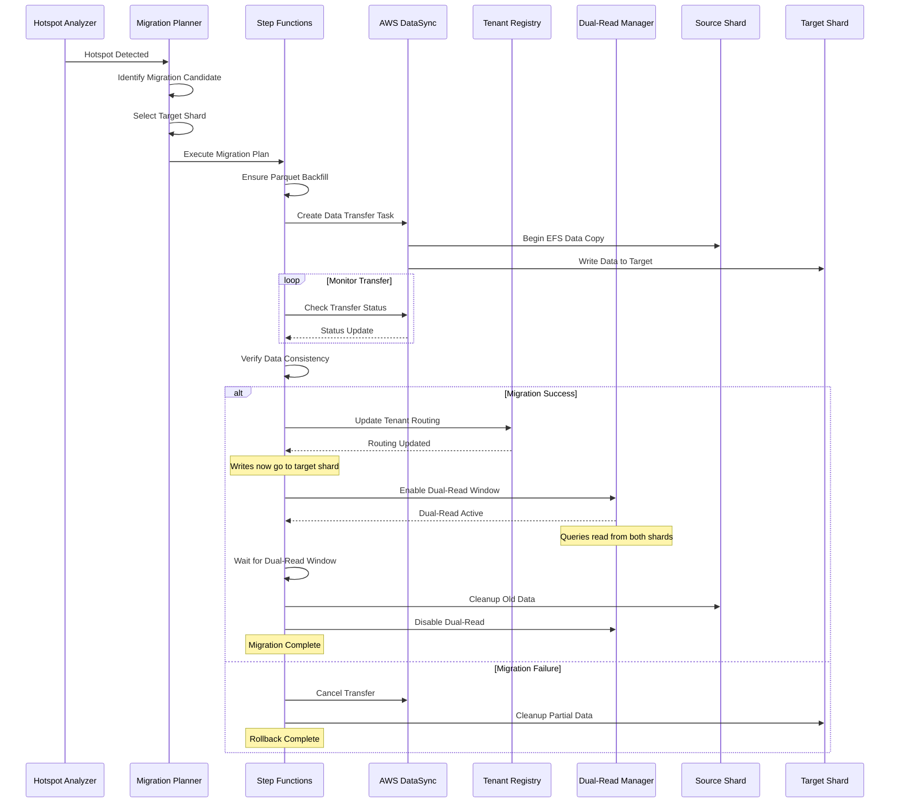

# Sharding and Multi-Tenancy Subsystem Design

## Overview

The Sharding subsystem provides transparent multi-tenant isolation with automatic load balancing. It handles tenant routing, hotspot detection, and zero-downtime shard migrations while maintaining complete tenant invisibility to the underlying infrastructure.

## Architecture

## C4 Container Diagram

### Multi-Tenancy Model

## Tenant Management

### Tenant Data Model

The tenant registry stores comprehensive information about each tenant including identity, regional preferences, resource limits, and migration status. Key attributes include:

**Core Identity**: API key mappings, unique tenant identifiers, and organizational metadata
**Regional Assignment**: Home region designation, data residency policies, and approved secondary regions
**Resource Limits**: Ingestion rate limits, query concurrency bounds, and retention policies
**Migration State**: Current shard assignment, target shard during migrations, and cutover timing

The tenant table uses DynamoDB Global Tables for multi-region replication with eventual consistency. This enables fast local lookups while maintaining global state synchronization.

### Global Routing (Lambda@Edge)

#### Tenant Resolution and Caching

CloudFront Lambda@Edge functions provide the first layer of tenant routing. These functions:

1. **Extract API Keys**: Support multiple header formats and query parameters
2. **Cache Tenant Mappings**: 5-minute TTL with LRU eviction for edge performance  
3. **Route to Home Region**: Direct requests to tenant-specific regional origins
4. **Add Context Headers**: Inject tenant metadata for downstream processing

The edge caching strategy balances performance with consistency requirements. Short TTL values ensure rapid propagation of tenant changes while providing substantial performance benefits for active tenants.

### Regional Components

#### Lambda Authorizer
Regional authorizers provide the second layer of tenant validation and context enrichment. They perform detailed authentication, check tenant status, validate regional access permissions, and detect migration scenarios.

The authorizer uses regional DynamoDB replicas with eventual consistency reads for performance. Results include comprehensive tenant context for downstream services including shard assignments and permission scopes.

#### Router Lambda  
Router Lambdas coordinate request distribution to shard-specific functions. They handle normal routing, migration scenarios with dual-read capabilities, and error handling with appropriate fallbacks.

During migrations, routers implement sophisticated logic to direct writes to new shards while supporting dual-read queries across both old and new locations.

## Shard Management

### Shard Assignment Algorithm

#### Rendezvous Hashing
The system uses rendezvous (highest random weight) hashing for consistent tenant assignment to shards. This algorithm provides several advantages:

**Consistency**: Minimal reassignment when shards are added or removed
**Load Balancing**: Even distribution with capacity weighting support
**Locality**: Deterministic assignment without coordination overhead

The algorithm incorporates shard capacity weights and current utilization levels to prefer underutilized resources while maintaining assignment stability.

### Hotspot Detection

#### Metrics Collection
The hotspot detection system continuously monitors key performance indicators across all shards:

**Throughput Metrics**: Ingestion TPS, query QPS, data transfer rates
**Resource Utilization**: EFS utilization, Lambda concurrency, I/O wait times  
**Performance Metrics**: Latency percentiles, error rates, throttling incidents
**Fairness Metrics**: Tenant concentration, resource distribution patterns

#### Detection Algorithm
Hotspot detection uses configurable thresholds with time-based analysis:

1. **SLO Violations**: EFS utilization >80% AND query p95 >2 seconds for 10+ minutes
2. **Fairness Issues**: Single tenant consuming >30% of shard resources
3. **Sustained Pressure**: Resource contention patterns lasting multiple evaluation windows

The detection algorithm considers both absolute performance degradation and relative fairness to ensure optimal resource utilization.

### Automated Rebalancing

#### Migration Planning
When hotspots are detected, the system automatically plans tenant migrations:

1. **Tenant Identification**: Analyze resource consumption patterns to identify migration candidates
2. **Target Selection**: Use rendezvous hashing with current capacity constraints
3. **Impact Assessment**: Estimate data volumes, migration duration, and resource requirements
4. **Schedule Coordination**: Ensure migration limits and maintenance windows

Migration decisions balance immediate hotspot relief with long-term stability and tenant impact minimization.

#### Zero-Downtime Migration

##### Migration State Machine

##### Migration Execution Sequence

The migration process ensures zero downtime through careful orchestration:

**Phase 1 - Preparation**: Ensure Parquet backfill completeness and initiate DataSync for hot data
**Phase 2 - Data Copy**: Transfer EFS data to target shard with integrity verification  
**Phase 3 - Cutover**: Atomically update routing to direct writes to new shard
**Phase 4 - Dual Read**: Enable dual-read window to ensure query completeness
**Phase 5 - Cleanup**: Clean up old shard data after dual-read window expires

### Dual-Read Window Implementation

During migrations, the system implements a dual-read strategy to ensure query completeness:

**Write Cutover**: New writes immediately go to the target shard after cutover
**Read Strategy**: Queries access both old and new shards during transition window
**Result Merging**: Combine results from both shards with deduplication
**Window Duration**: Configurable period (typically 2 hours) based on data lateness patterns

This approach ensures that queries see complete data during the transition period while minimizing performance impact.

## Data Residency and Cross-Region Policies

### Residency Policy Implementation

The system supports three data residency policies that balance compliance requirements with operational flexibility:

#### Strict Policy
- **Behavior**: Data never leaves home region under any circumstances
- **Failure Handling**: Return 503 errors if home region is unavailable
- **Use Case**: Highly regulated environments with absolute residency requirements

#### Permitted Policy  
- **Behavior**: Allows processing in explicitly approved secondary regions
- **Data Replication**: Async Parquet replication to secondary regions for DR
- **Failure Handling**: Query failover to replicated data in secondary regions

#### Deferred Policy
- **Behavior**: Queues operations during home region outages
- **Processing**: Replay queued operations when home region recovers
- **Use Case**: Eventually consistent requirements with cost optimization

### Regional Independence

Each region maintains complete operational independence to support data residency requirements:

**Regional Components**: Complete ingest, query, and storage infrastructure per region
**Metadata Isolation**: Regional Aurora catalogs with no cross-region dependencies
**Failure Isolation**: Regional outages don't impact other regions' operations

The only global components are the tenant registry and CDN routing layer, which provide necessary coordination while respecting residency boundaries.

## Performance Characteristics

### Throughput Targets
- **Per-Tenant Ingestion**: 100k+ events/second sustained
- **Regional Query Capacity**: 1000+ concurrent queries  
- **Migration Throughput**: Complete tenant migration within 30 minutes

### Latency Targets
- **Routing Latency**: <50ms for API key resolution and shard routing
- **Hotspot Detection**: <10 minutes from threshold breach to migration initiation
- **Migration Cutover**: <30 seconds for routing updates to propagate

### Scalability Characteristics
- **Horizontal Scaling**: Automatic shard provisioning based on demand
- **Tenant Density**: 1000+ tenants per shard with proper resource allocation
- **Regional Capacity**: PB-scale data processing per region

## Operational Characteristics

### Monitoring and Alerting

The sharding system provides comprehensive monitoring across multiple dimensions:

**Performance Monitoring**: Real-time dashboards for throughput, latency, and resource utilization
**Tenant Analytics**: Per-tenant usage patterns and cost attribution
**Migration Tracking**: Progress monitoring and success rate analysis
**Capacity Planning**: Predictive analytics for shard provisioning

### Configuration Management

Sharding parameters are configurable to support different operational requirements:

**Hotspot Thresholds**: Customizable SLO limits and detection windows
**Migration Policies**: Tenant size limits, migration schedules, and approval workflows
**Capacity Management**: Shard sizing, tenant density limits, and auto-scaling triggers
