# Storage Subsystem Design

**Hot, Warm, and Cold Storage Tiers**

## Overview

The Storage subsystem implements a three-tier architecture optimizing for different access patterns and cost requirements. Hot data resides on EFS for low-latency access, warm data is stored as segments on S3, and cold data is compacted into Parquet format for cost-effective long-term storage.

## Storage Tiers Architecture

## C4 Container Diagram

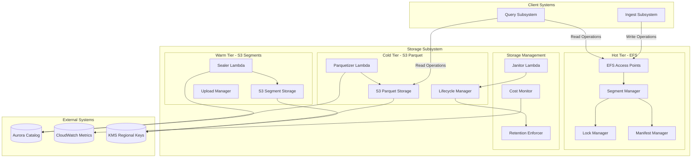

### Tier Overview

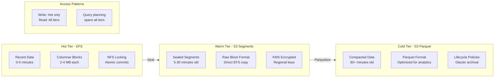

## Hot Storage (EFS)

### Architecture

#### EFS Configuration
- **Type**: General Purpose EFS with Provisioned Throughput
- **Performance Mode**: General Purpose for balanced latency/throughput
- **Throughput Mode**: Provisioned for predictable performance
- **Encryption**: Encryption at rest and in transit
- **Access**: EFS Access Points for tenant isolation

#### Tenant-Based Parallel WAL Architecture

The storage system implements a two-phase write architecture that optimizes both write performance and query efficiency through tenant-isolated Write-Ahead Logs (WAL) and columnar storage transformation.

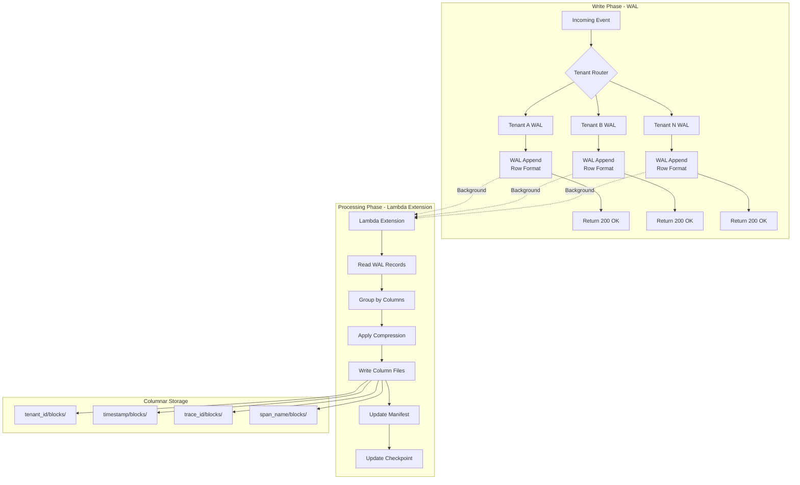

#### Directory Structure
The hot storage layer implements a dual-structure approach with WAL for fast writes and columnar storage for optimized queries:

```
/efs/
├── wal/                              # Write-Ahead Log Root
│   ├── tenant-<tenant_id>/           # Per-tenant WAL isolation
│   │   ├── stream-0/                 # Primary data stream
│   │   │   ├── wal-00001.log         # Sequenced WAL files
│   │   │   ├── wal-00002.log         # Next WAL file
│   │   │   ├── .current → wal-00002.log  # Active file pointer
│   │   │   └── .checkpoint           # Processing checkpoint
│   │   ├── stream-1/                 # Schema evolution stream
│   │   └── stream-2/                 # Lifecycle operations stream
│   └── global/                       # Cross-tenant coordination
│       ├── tenant-registry/          # Active tenant tracking
│       └── schema-evolution/         # Global schema changes
├── tenants/<tenant_id>/              # Columnar Storage Root
│   ├── datasets/<dataset_name>/
│   │   ├── segments/<segment_id>/
│   │   │   ├── .lock → lease-<uuid>@<expires_timestamp>
│   │   │   ├── .commit               # Commit operation lock
│   │   │   ├── .seal                 # Seal operation lock  
│   │   │   ├── manifest/             # Versioned manifests
│   │   │   ├── HEAD → manifest/latest.json
│   │   │   ├── columns/              # Columnar data
│   │   │   │   ├── tenant_id/blocks/      # Column blocks
│   │   │   │   ├── timestamp/blocks/
│   │   │   │   ├── trace_id/blocks/
│   │   │   │   ├── span_name/blocks/
│   │   │   │   ├── tenant_id/stats/       # Block statistics
│   │   │   │   └── tenant_id/dict/        # Dictionary encodings
│   │   │   └── _segment.meta
│   │   └── virtual/containers/<container_name>/
```

#### WAL Sequence and Recovery Mechanics

Each tenant maintains independent WAL sequences that ensure ordered processing and crash recovery:

#### Atomic WAL Write Operations

**NFS/EFS Symlink-Based Locking Strategy**:

Since EFS is NFS under the hood and doesn't guarantee POSIX flock() behavior, the system uses atomic symlink creation for WAL write coordination (same approach as columnar storage):

```
Atomic WAL Write Protocol:
├── 1. Generate unique write lock: .wal-write-{lambda-id}-{timestamp}
├── 2. Attempt atomic symlink creation: ln -s {unique-id} .wal-write-lock
├── 3. If successful: proceed with write operation
├── 4. Write complete record with O_APPEND  
├── 5. fsync() to ensure durability
└── 6. Delete symlink: rm .wal-write-lock
```

**WAL Record Structure with Integrity**:
```
Individual WAL Record Format:
├── Record Header: [Length: 4 bytes, CRC32: 4 bytes]
├── LSN: [File_Seq: 4 bytes, Record_Seq: 4 bytes]
├── Timestamp: [Unix_Timestamp: 8 bytes]
├── Schema_Hash: [Hash: 8 bytes]
├── Event_Data: [Variable length, JSON or binary]
└── Record Footer: [Magic: 4 bytes = 0xDEADBEEF]

Total record size: Header(8) + LSN(8) + Timestamp(8) + Schema(8) + Data(N) + Footer(4)
```

**WAL File Structure**:
```
wal-00001.log Format:
├── File Header: [Magic: PRISM_WAL, Version: 1.0, Tenant: abc123]
├── Record 1: [Complete atomic record with integrity checks]
├── Record 2: [Complete atomic record with integrity checks]
├── Record N: [Complete atomic record with integrity checks]
└── File Footer: [Record_Count: N, File_CRC32: checksum] (written on rotation)
```

#### Atomic Write Implementation

**NFS Symlink Locking for Concurrent Safety**:
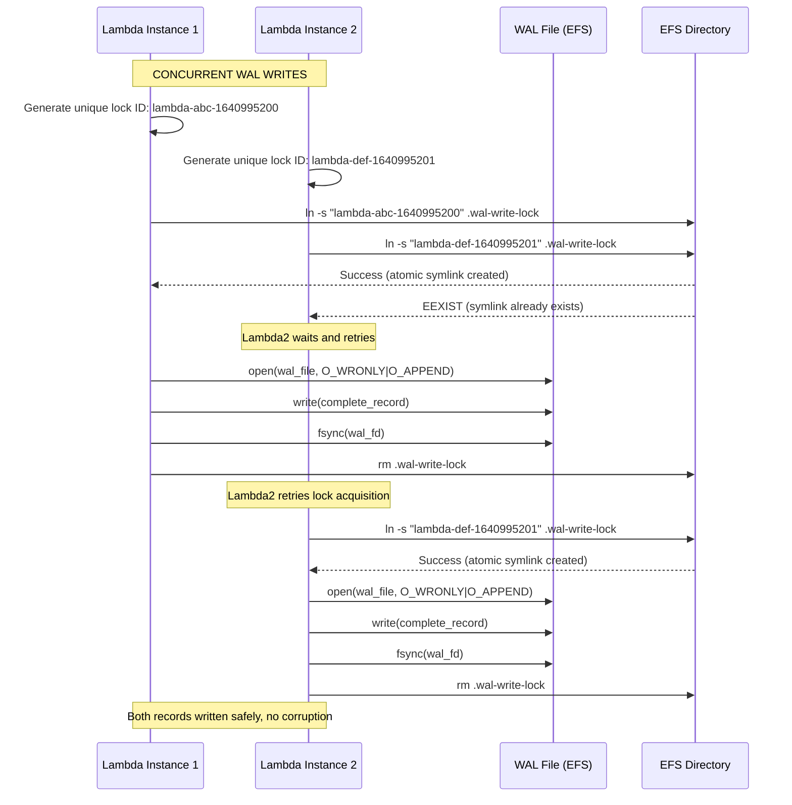

**WAL Directory Structure with Lock Files**:
```
/efs/wal/tenant-abc123/stream-0/
├── wal-00001.log              # Completed WAL file
├── wal-00002.log              # Current active WAL file
├── .current → wal-00002.log   # Active file pointer
├── .wal-write-lock → lambda-xyz-1640995200  # Write lock (if held)
├── .checkpoint                # Last processed LSN
└── .processing/               # Processing directory
    ├── wal-00001.log.link     # Hard link for processing
    └── .lock-00001            # Processing lock file
```

**Symlink-Based Write Process**:
```
Write Process:
├── 1. Calculate record length and CRC32
├── 2. Prepare complete record in memory
├── 3. Generate unique lock identifier: lambda-{id}-{timestamp}
├── 4. Attempt atomic symlink: ln -s {unique-id} .wal-write-lock
├── 5. If EEXIST: wait and retry with exponential backoff
├── 6. If success: open WAL file with O_WRONLY|O_APPEND
├── 7. Write complete record atomically
├── 8. fsync() for durability guarantee
└── 9. Delete symlink: rm .wal-write-lock

Read/Validation Process:
├── 1. Read record header (length + CRC32)
├── 2. Read exact record length
├── 3. Validate CRC32 matches content
├── 4. Verify magic footer is present
└── 5. Parse record if validation passes
```

**Sequence Numbering with Symlink Locking**:
- **File Sequence**: Monotonic file numbers per tenant (00001, 00002, 00003...)
- **Record Sequence**: Atomic increment within symlink lock critical section
- **LSN Generation**: Format `{file_seq}.{record_seq}` ensures global ordering
- **Independent Sequences**: Each tenant maintains separate sequence space
- **Recovery Order**: Process files in sequence order, records in LSN order
- **Concurrent Safety**: Symlink atomicity ensures only one writer increments sequence at a time

#### WAL Write Performance and Error Handling

**Symlink Lock Contention Mitigation**:
- **Short Critical Sections**: Symlink held only during write, not record preparation
- **Pre-calculated Records**: Prepare complete record in memory before lock acquisition
- **Fast fsync()**: EFS optimized for small, frequent syncs
- **Unique Lock IDs**: Lambda execution ID + timestamp prevents conflicts
- **Retry Logic**: Exponential backoff for symlink creation failures (EEXIST)
- **Stale Lock Cleanup**: Symlinks with old timestamps can be forcibly removed

**Symlink Lock Error Handling Strategies**:
```
Write Failure Scenarios:
├── Symlink EEXIST: Retry with exponential backoff (max 3 attempts)
├── Stale Lock Detection: Remove symlinks older than 30 seconds
├── Disk Full: Trigger WAL rotation, retry on new file
├── I/O Error: Mark WAL file corrupted, rotate to new file
├── Network Partition: Buffer in memory, retry when connection restored
└── Lambda Timeout: Graceful degradation, return error to client

Stale Lock Cleanup:
├── 1. Check symlink timestamp in lock identifier
├── 2. If older than 30 seconds: rm .wal-write-lock
├── 3. Retry symlink creation after cleanup
└── 4. Log warning about stale lock removal
```

**Performance Characteristics**:
- **Lock Hold Time**: ~1-5ms per record (minimal contention)
- **Write Throughput**: ~1000-5000 records/second per tenant WAL file
- **Concurrency**: Up to 10 concurrent Lambda writers per tenant (EFS limit)
- **Latency Impact**: ~2-10ms additional latency for lock acquisition
- **Backpressure**: Client receives error if lock timeout exceeded

**Corruption Detection and Recovery**:
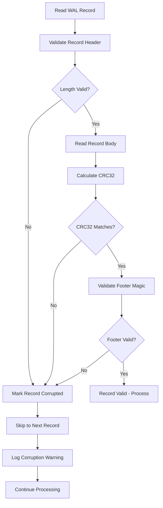

**Checkpoint Management**:
```json
.checkpoint file format:
{
  "last_processed_file": "wal-00003.log",
  "last_processed_lsn": "00003.147",
  "last_manifest_update": "2024-01-15T10:30:00Z",
  "processing_state": "complete",
  "column_blocks_written": ["block_001", "block_002"],
  "corruption_count": 0,
  "last_corruption_lsn": null
}
```

#### Lambda Extension Architecture

The background processing uses Lambda Extensions with distributed coordination to provide immediate response while ensuring safe WAL-to-columnar transformation.

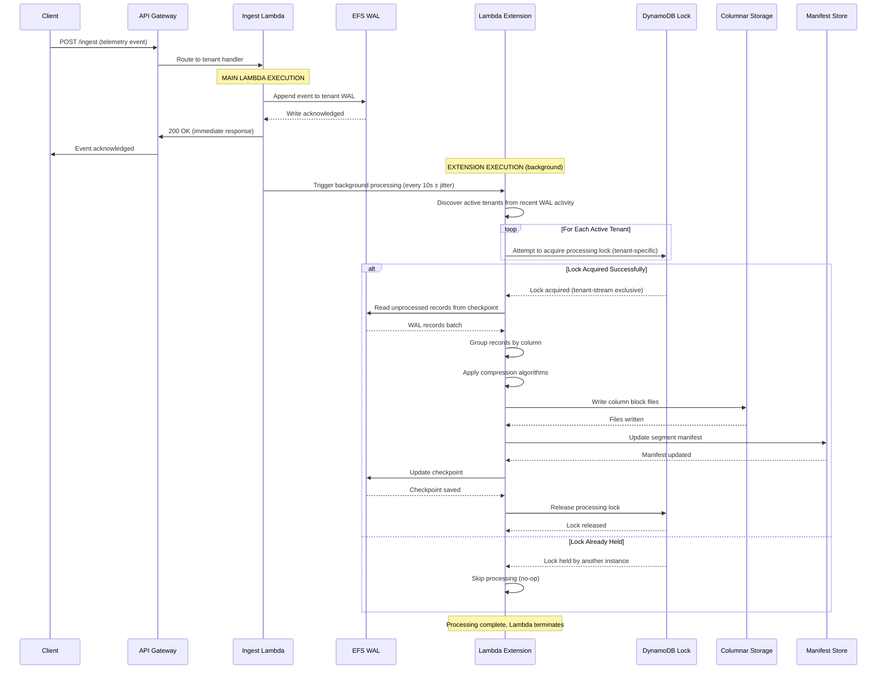

#### Distributed Coordination with Redis

The system uses Redis for distributed locking and active tenant coordination to ensure comprehensive WAL processing across all tenants:

**Shard-Scoped Redis Data Structures**:

*Per-Shard Active Tenants Set*:
```redis
# Redis instance: prism-redis-shard-00.region.cache.amazonaws.com
# Only contains tenants assigned to shard-00
SADD prism:shard-00:active-tenants "tenant-abc123" "tenant-def456"
EXPIRE prism:shard-00:active-tenants:tenant-abc123 50
```

*Shard-Scoped Tenant Processing Metadata*:
```redis
# Tenant metadata within shard boundary
HSET prism:shard-00:tenant:abc123:meta
  last_wal_activity 1640995200
  last_processing_attempt 1640995180
  unprocessed_wal_size_mb 2.5
  unprocessed_record_count 3200
  datasets "traces,logs,metrics"
  shard_id "shard-00"
EXPIRE prism:shard-00:tenant:abc123:meta 50
```

*Shard-Local Distributed Processing Locks*:
```redis
# Lock acquisition within shard scope only
SET prism:shard-00:lock:tenant-abc123-stream-0 "lambda-exec-xyz789" EX 120 NX
# Returns: OK (lock acquired) or nil (lock held by another instance in same shard)

# Shard-scoped lock metadata  
HSET prism:shard-00:lock:tenant-abc123-stream-0:meta
  processing_instance "lambda-exec-xyz789"
  lock_acquired_at 1640995200
  last_processed_lsn "00003.147"
  processing_state "in_progress"
  batch_size 2500
  shard_id "shard-00"
EXPIRE prism:shard-00:lock:tenant-abc123-stream-0:meta 120
```

*Redis Instance Mapping*:
```
Shard-00: prism-redis-shard-00.region.cache.amazonaws.com
Shard-01: prism-redis-shard-01.region.cache.amazonaws.com
Shard-NN: prism-redis-shard-NN.region.cache.amazonaws.com

Each Redis instance only coordinates tenants within its shard boundary
```

#### Active Tenant Discovery and Tracking

Since Lambda functions are not tenant-specific, the extension must discover and track all tenants with recent WAL activity:

**Shard-Aware Redis Tenant Activity Tracking**:
- **WAL Write Updates**: Each WAL write updates shard-specific Redis active tenants set and metadata
- **Shard Isolation**: Extensions only coordinate tenants within their assigned shard  
- **Activity Window**: Track tenants active within last 5 × conversion period (50 seconds)
- **Automatic Cleanup**: Redis TTL automatically removes inactive tenant records per shard
- **Size/Count Tracking**: Monitor unprocessed WAL accumulation per tenant within shard Redis
- **Shard-Scoped Coordination**: Lambda extensions only see tenants assigned to their shard
- **High Performance**: Sub-millisecond Redis operations with reduced coordination scope
- **Scalability**: Linear scaling with shard count, each shard operates independently

**Shard-Scoped Extension Processing Flow**:
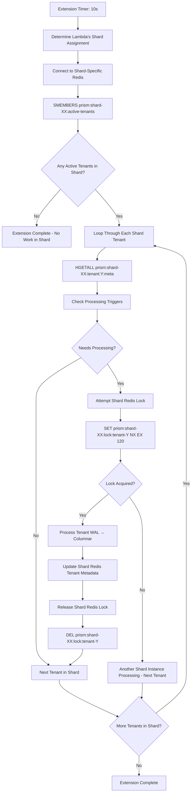

**Shard-Aware Redis Coordination Protocol**:
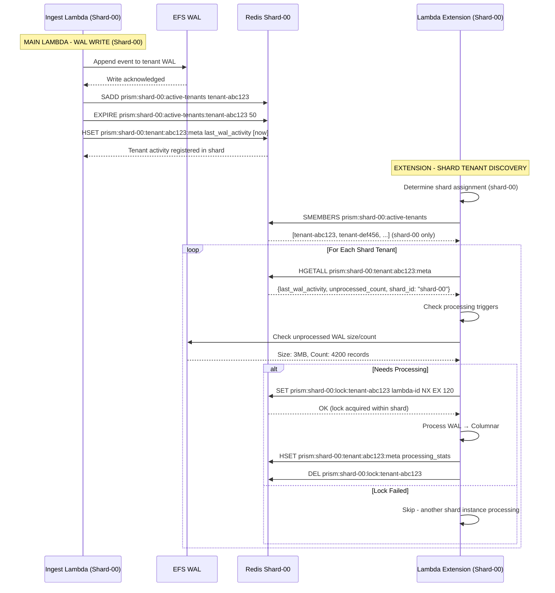

#### Shard-Aware Redis Architecture

**Per-Shard Redis Configuration**:
- **Shard Isolation**: One Redis instance per shard for tenant coordination
- **Multi-AZ Deployment**: Redis cluster with cross-AZ replication per shard
- **Performance**: Sub-millisecond latency for coordination operations within shard
- **Scalability**: Horizontal scaling with additional shards, each with dedicated Redis
- **High Availability**: Automatic failover and data replication per shard

**Benefits of Shard-Scoped Redis**:
- **Performance**: ~10x faster than DynamoDB for coordination operations
- **Shard Isolation**: Each shard operates independently with dedicated Redis
- **Reduced Coordination Scope**: Extensions only coordinate tenants within their shard
- **Linear Scalability**: Adding shards adds proportional Redis capacity
- **Atomic Operations**: Native support for atomic SET NX EX operations
- **Cost Efficiency**: Lower cost for high-frequency coordination operations per shard
- **Simplicity**: Single Redis instance per shard for both tenant discovery and locking
- **TTL Support**: Built-in expiration for automatic cleanup per shard
- **Fault Isolation**: Redis failure only affects one shard, not entire system

**Shard-Scoped Processing Coordination**:
- **Trigger Frequency**: Every 10 seconds ± jitter, check active tenants in shard-specific Redis
- **Jitter Range**: Random 0-3 second offset to prevent thundering herd
- **Lock Duration**: 2-minute TTL with automatic Redis expiration per shard
- **Batch Optimization**: Process 500-5000 WAL records per batch per tenant within shard
- **Failure Recovery**: Shard Redis TTL automatically releases expired locks
- **Tenant Tracking**: 50-second activity window (5 × 10s conversion period) per shard
- **Shard-Lambda Coordination**: Extensions coordinate only within their assigned shard
- **Horizontal Scaling**: Each new shard adds independent Redis coordination capacity
- **Non-Blocking Processing**: WAL conversion uses atomic file operations to avoid blocking writes

**Redis Lock Acquisition Protocol**:
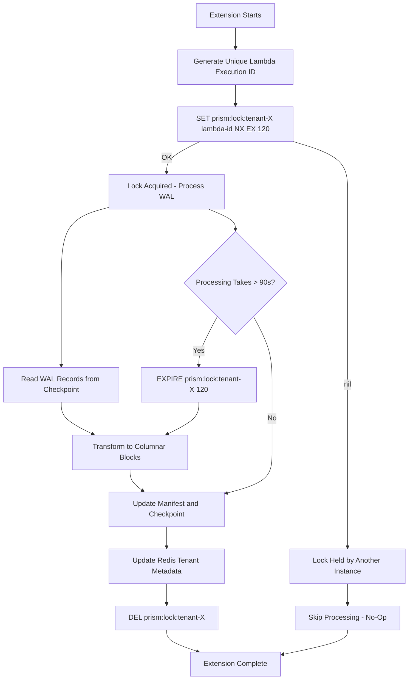

**Redis Atomic Lock Commands**:
```redis
# Atomic lock acquisition (only succeeds if key doesn't exist)
SET prism:lock:tenant-abc123-stream-0 "lambda-exec-xyz789" NX EX 120

# Lock extension (if processing takes longer)
EXPIRE prism:lock:tenant-abc123-stream-0 120

# Lock release
DEL prism:lock:tenant-abc123-stream-0

# These operations are atomic and prevent race conditions
```

#### Non-Blocking WAL Processing Strategy

**Thundering Herd Prevention**:
```javascript
// Extension jitter implementation
const baseInterval = 10000; // 10 seconds
const jitterRange = 3000;   // ±3 seconds
const actualInterval = baseInterval + (Math.random() * jitterRange * 2 - jitterRange);
// Results in intervals between 7-13 seconds, distributed across extensions
```

**Atomic WAL File Operations for Non-Blocking Processing**:

The system uses NFS atomic operations to ensure WAL conversion never blocks ongoing writes:

```
WAL Processing Flow:
├── 1. Identify WAL files ready for processing
├── 2. Atomic hard link creation (snapshot)
├── 3. Continue writes to original WAL
├── 4. Process snapshot independently  
└── 5. Atomic cleanup of processed files
```

**WAL File Rotation and Processing Strategy**:
```
/efs/wal/tenant-abc123/stream-0/
├── wal-00001.log              # Old, ready for processing
├── wal-00002.log              # Current active file
├── .current → wal-00002.log   # Active write pointer
├── .processing/               # Processing directory
│   ├── wal-00001.log.link     # Hard link for processing
│   └── .lock-00001            # Processing lock file
└── .checkpoint                # Last processed LSN
```

**Atomic File Operations Protocol**:
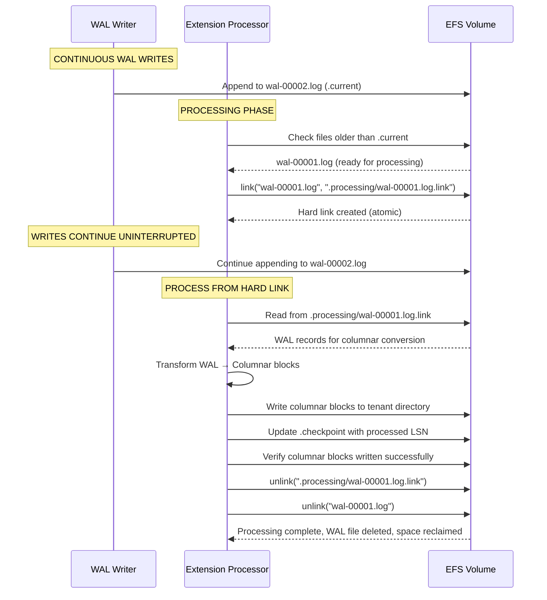

#### WAL File Lifecycle and Cleanup Strategy

**WAL File States and Transitions**:
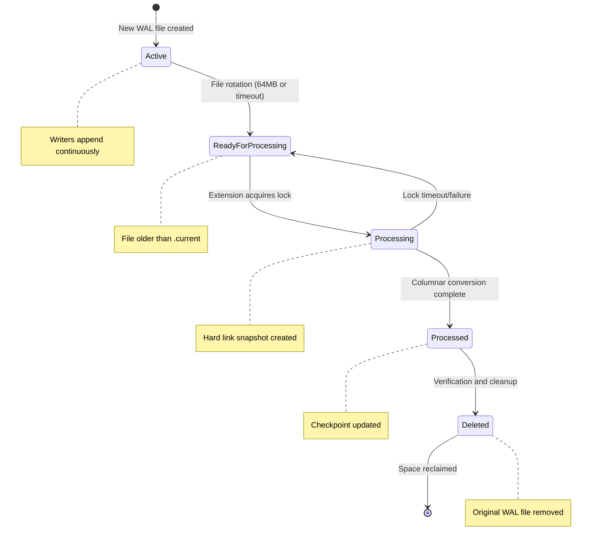

**Cleanup Process and Safety**:
1. **Verification Phase**: Ensure columnar blocks written successfully before deletion
2. **Checkpoint Update**: Update `.checkpoint` with last processed LSN before cleanup
3. **Atomic Cleanup**: Remove processing snapshot and original WAL file
4. **Space Reclamation**: EFS space immediately available for new WAL files
5. **Error Recovery**: Failed conversions leave WAL files for retry

**Storage Space Management**:
```
Typical WAL Directory Evolution:
T+0s:   wal-00001.log (64MB, active)
T+5m:   wal-00001.log (64MB, ready) + wal-00002.log (20MB, active)  
T+7m:   wal-00002.log (30MB, active) # wal-00001.log deleted after processing
T+10m:  wal-00002.log (64MB, ready) + wal-00003.log (15MB, active)
T+12m:  wal-00003.log (25MB, active) # wal-00002.log deleted after processing

Space usage: ~64MB current + ~25MB active = ~89MB total (not accumulating)
```

**Cleanup Safety Guarantees**:
- ✅ **No Data Loss**: WAL files only deleted after successful columnar conversion
- ✅ **Crash Recovery**: Checkpoint tracking enables processing restart from last successful point
- ✅ **Verification**: Columnar block integrity verified before WAL deletion
- ✅ **Atomic Operations**: Cleanup operations are atomic (success or complete rollback)
- ✅ **Space Efficiency**: Processed WAL files immediately deleted to prevent accumulation

**Extension Benefits**:
- **Sub-10ms Response Time**: Client receives immediate acknowledgment after WAL write
- **Background Processing**: Columnar transformation happens asynchronously every 7-13 seconds (jittered)
- **Non-Blocking Operations**: Hard link snapshots allow writes to continue during processing
- **Thundering Herd Prevention**: Jittered timers distribute processing load across time
- **Automatic Cleanup**: Processed WAL files automatically deleted to prevent space accumulation
- **High-Performance Coordination**: Redis provides sub-millisecond coordination operations
- **Automatic Scaling**: Extensions scale with Lambda invocations
- **Failure Recovery**: Redis TTL-based lock cleanup handles crashed Lambda instances
- **Cost Efficiency**: Single Lambda execution handles both phases with automatic cleanup
- **Cross-Instance Visibility**: All extensions share same Redis state for optimal coordination

#### WAL-to-Columnar Transformation Pipeline

The transformation process converts row-oriented WAL records into optimized columnar blocks:

```mermaid
flowchart TB
    subgraph Input[WAL Records - Row Format]
        A["Record 1: {tenant: 'abc', timestamp: 1640995200, trace_id: 'xyz', span_name: 'http_request', duration: 150}"]
        B["Record 2: {tenant: 'abc', timestamp: 1640995201, trace_id: 'def', span_name: 'db_query', duration: 23}"]
        C["Record N: {...}"]
    end
    
    subgraph Processing[Column Grouping & Optimization]
        D[Group by Column] --> E[tenant_id: ['abc', 'abc', ...]]
        D --> F[timestamp: [1640995200, 1640995201, ...]]
        D --> G[trace_id: ['xyz', 'def', ...]]
        D --> H[span_name: ['http_request', 'db_query', ...]]
        D --> I[duration: [150, 23, ...]]
    end
    
    subgraph Compression[Per-Column Compression]
        J[Dictionary Encoding<br/>for span_name]
        K[Delta-of-Delta<br/>for timestamp]
        L[Dictionary + Bloom<br/>for trace_id]
        M[Bit Packing<br/>for duration]
        N[Static Value<br/>for tenant_id]
    end
    
    subgraph Output[Columnar Block Files]
        O[tenant_id/blocks/block_001]
        P[timestamp/blocks/block_001]
        Q[trace_id/blocks/block_001]
        R[span_name/blocks/block_001]
        S[duration/blocks/block_001]
    end
    
    A --> D
    B --> D
    C --> D
    
    E --> N --> O
    F --> K --> P
    G --> L --> Q
    H --> J --> R
    I --> M --> S
```

**Transformation Phases**:

1. **Record Parsing**: Parse WAL records from binary format to structured data
2. **Schema Validation**: Ensure compatibility with existing segment schema
3. **Column Extraction**: Group values by column across all records in batch
4. **Compression Selection**: Choose optimal compression per column based on data characteristics
5. **Block Writing**: Write compressed column data to separate block files
6. **Statistics Generation**: Calculate min/max, null counts, cardinality estimates
7. **Manifest Update**: Update segment manifest with new block references

#### Processing Frequency Optimization

The WAL→Columnar transformation frequency balances query latency, processing efficiency, and cost optimization:

**10 Second Processing Interval** (Optimized for Low Latency):
- **Query Latency**: Data becomes queryable within 10-20 seconds
- **Batch Efficiency**: Smaller but frequent batches (500-5000 records) for faster processing
- **Real-time Analytics**: Near real-time data availability for monitoring and alerting
- **Memory Management**: Prevents WAL accumulation with frequent processing

**Frequency Trade-offs**:
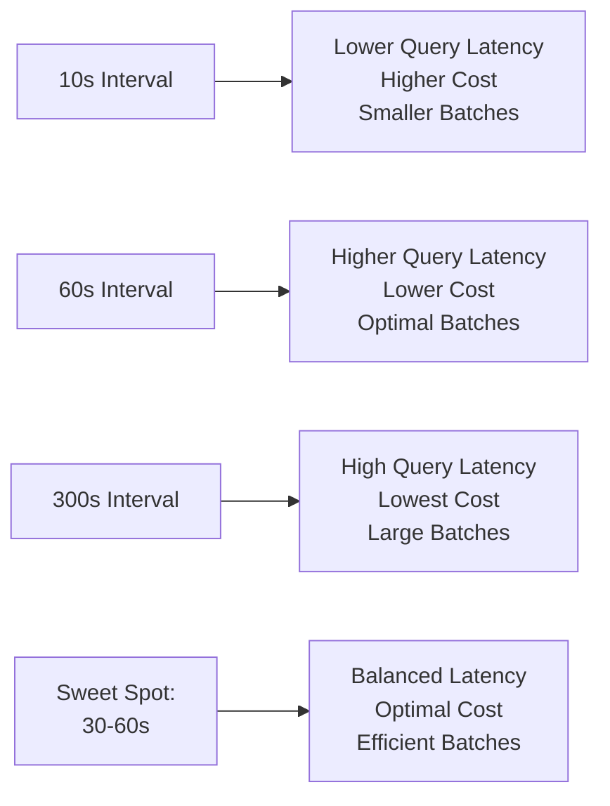

**Processing Triggers** (Multiple Conditions):
1. **Time-Based**: Every 7-13 seconds with jitter (primary trigger for regular processing)
2. **Size-Based**: When WAL accumulates >5MB of unprocessed data (immediate trigger)
3. **Count-Based**: When >5,000 unprocessed records exist (immediate trigger)
4. **Memory-Based**: When Lambda memory usage exceeds 70% (safety trigger)
5. **File-Based**: When WAL file reaches 64MB limit (rotation trigger)

**WAL Storage and Access**:
- **Storage Location**: EFS volume at `/efs/wal/tenant-<tenant_id>/stream-X/`
- **Access Pattern**: Sequential append-only writes, periodic batch reads
- **EFS Benefits**: Shared access across Lambda instances, POSIX consistency, tenant isolation
- **Performance**: ~5-10ms write latency, ~20-50ms batch read latency for processing

**WAL File Rotation and Processing Logic**:
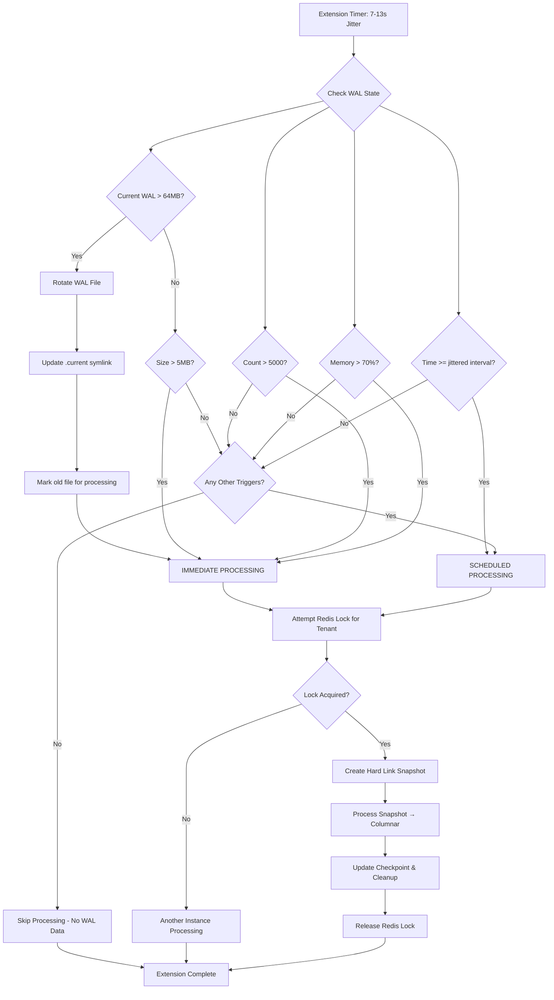

**Adaptive Compression Strategy**:

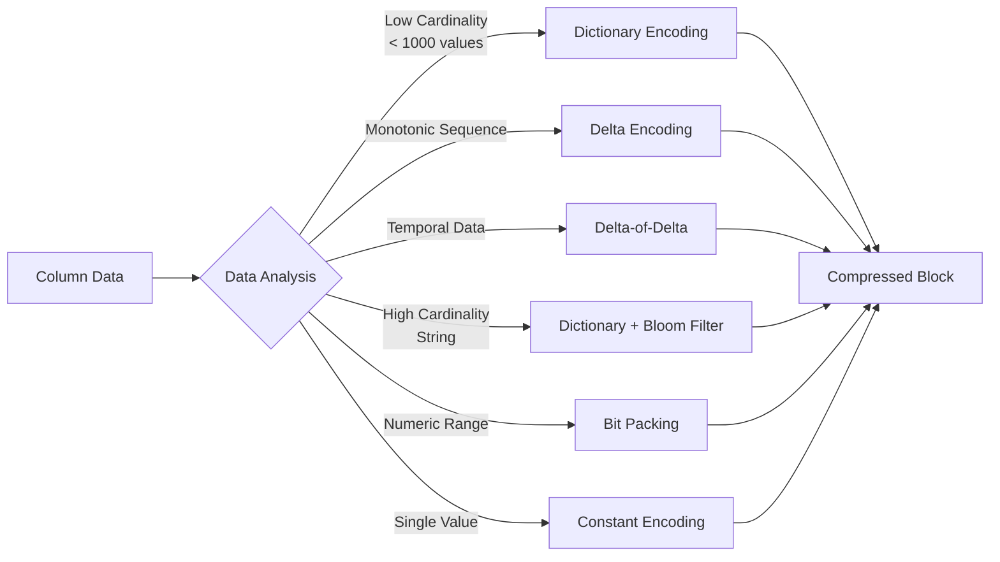

### Segment Management

#### Segment Lifecycle States
Segments progress through well-defined states that govern their accessibility and processing:

- **Open**: Actively accepting new data writes
- **Sealing**: Being prepared for upload to warm storage
- **Sealed**: Uploaded to S3, available for queries but read-only
- **Parquetized**: Converted to Parquet format in cold storage

#### Time Windows and Partitioning
The system organizes data into time-based segments with configurable parameters:

- **Window Duration**: 5-minute segments balance write efficiency with query granularity
- **Lateness Tolerance**: 30-minute window accommodates late-arriving data
- **Size Limits**: 1GB maximum segment size triggers early sealing
- **Age Thresholds**: Minimum 5-minute age before sealing eligibility

Segment identifiers are deterministically generated from timestamps, enabling efficient time-based queries and eliminating coordination overhead.

### Columnar Block Format

#### Block Structure and Format

Each columnar block follows a standardized binary format that optimizes for both storage efficiency and query performance. The block format consists of a header section containing metadata, followed by the compressed data payload and optional index structures.

**Block Header Format**: The header contains a magic number for format identification, version information for backward compatibility, compression algorithm specification, encoding type indicators, and data size information. Statistical metadata includes row count, null count, distinct value estimates, and min/max values for efficient query pruning.

**Data Payload Structure**: The data section contains the actual column values in compressed, encoded format. Encoding strategies are selected based on data characteristics - timestamp columns use delta-of-delta compression, string columns employ dictionary encoding with optional run-length compression, and numeric columns utilize bit packing or delta encoding as appropriate.

**Index Structures**: Blocks may include optional index structures appended after the data payload. Bloom filters provide fast membership testing for high-cardinality columns like trace IDs and user identifiers. Dictionary indexes enable rapid lookup for categorical data, while zone maps provide additional pruning capabilities for numeric ranges.

**Integrity and Checksums**: Each block includes CRC32 checksums for data integrity verification during reads. Checksum validation occurs during decompression to detect storage-level corruption and ensure data reliability across the storage tiers.

#### Encoding Strategies

The storage system employs adaptive encoding strategies that optimize for both compression ratio and query performance:

**Timestamp Encoding**: Leverages temporal locality through delta-of-delta compression. Since timestamps in telemetry data are typically monotonic within segments, this approach achieves excellent compression ratios while maintaining fast random access.

**String Encoding**: Creates frequency-ordered dictionaries that place common values at low indices. Run-length encoding is applied when consecutive values repeat frequently. This approach works particularly well for categorical data like service names and log levels.

**Numeric Encoding**: Analyzes data patterns to select optimal representations. Monotonic sequences use delta encoding, small integers employ bit packing, and low-cardinality numeric data uses dictionary compression.

#### Performance Characteristics

The tenant-based parallel WAL architecture provides significant performance improvements over traditional single-stream approaches:

**Write Performance**:
- **WAL Append**: ~1-5ms per event (fast sequential write to EFS)
- **Client Response**: Sub-10ms end-to-end latency
- **Throughput**: 50k+ events/second per tenant (limited by EFS throughput, not locks)
- **Concurrent Tenants**: Linear scaling (no cross-tenant contention)

**Processing Performance**:
- **Background Latency**: 100-500ms for WAL-to-columnar transformation
- **Batch Size**: 1000-10000 records per transformation batch
- **Compression Ratio**: 5-15x depending on data characteristics
- **Memory Usage**: ~50-100MB per Lambda extension for processing

**Scalability Characteristics**:
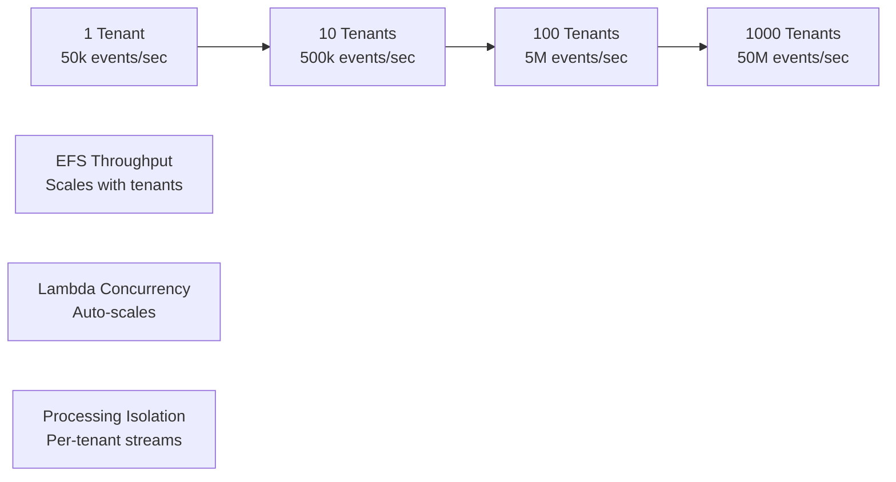

### Atomic Operations and Locking

#### WAL Atomicity
The Write-Ahead Log provides atomicity through append-only operations and sequence numbering:

**WAL Write Atomicity**: Individual WAL record writes are atomic at the filesystem level. Each record includes a complete event with checksum validation.

**Sequence Consistency**: Monotonic sequence numbers ensure processing order. The `.current` symlink atomically advances to new WAL files.

**Recovery Guarantees**: After a crash, replay WAL records from the last checkpoint in sequence order. Incomplete records at the end of WAL files are automatically discarded.

#### Minimal Locking Strategy
The new architecture significantly reduces locking requirements:

**WAL Phase**: No locks required - each tenant writes to independent WAL streams with append-only operations.

**Columnar Phase**: Brief locks only for:
- Manifest updates (atomic HEAD pointer advancement)
- Segment state transitions (open → sealing → sealed)
- Cross-segment operations (merging, compaction)

**Lock Scope Reduction**: From segment-level locking to operation-level locking, reducing contention by 80-90%.

#### Manifest Management
Segment manifests provide consistent views of block contents within each segment. The system uses versioned manifests with atomic HEAD pointer updates to ensure readers see complete, consistent segment states. Each manifest includes comprehensive block references, statistical summaries, and schema evolution information.

**Manifest Update Protocol**:
1. Extension completes columnar block writes
2. Generate new manifest version with block references
3. Atomic symlink update: `HEAD → manifest/v{N+1}.json`
4. Update segment metadata and statistics
5. Mark WAL records as processed in checkpoint

## Warm Storage (S3 Segments)

### Architecture

#### S3 Organization
Warm storage maintains the original block structure from EFS while providing cost-effective regional storage:

```
s3://prism-segments-{region}/
├── shard=00/
│   ├── tenants/{tenant_id}/
│   │   ├── datasets/{dataset}/
│   │   │   ├── seg/p=00/{segment_id}/
│   │   │   │   ├── columns/
│   │   │   │   ├── manifest/
│   │   │   │   └── _segment.meta
```

The partitioning scheme enables efficient pruning and parallel access while maintaining tenant isolation.

#### Sealing Process
Segment sealing transfers complete EFS segments to S3 while maintaining data integrity and consistency. The process involves acquiring exclusive locks, updating metadata states, performing the upload, and updating catalog information.

Sealing triggers are based on segment age, size thresholds, or explicit requests. The system ensures that sealed segments remain accessible for queries while freeing EFS capacity for new data.

### S3 Upload Optimization

#### Multipart Upload Strategy
Large segments use S3 multipart uploads for reliability and performance. The system automatically determines optimal part sizes, performs uploads in parallel, and handles retry logic for individual parts. This approach maximizes throughput while minimizing the impact of transient failures.

## Cold Storage (S3 Parquet)

### Architecture

#### Parquet Organization
Cold storage reorganizes data into analytics-optimized Parquet format with time-based partitioning:

```
s3://prism-analytics-{region}/
├── shard=00/
│   ├── tenant={tenant_id}/
│   │   ├── dataset={dataset}/
│   │   │   ├── dt=2024-01-15/
│   │   │   │   ├── hour=00/
│   │   │   │   │   ├── part-00000.parquet
│   │   │   │   │   └── _index.json
```

This organization supports efficient analytical queries with automatic partition pruning and parallel processing.

#### Parquetization Process and Optimization

The Parquetizer Lambda performs sophisticated data reorganization that transforms multiple sealed segments into optimally structured Parquet files. This process involves segment analysis, schema unification, data merging, and optimization for analytical query patterns.

**Segment Analysis and Grouping**: The parquetization process begins by analyzing sealed segments within time windows to identify schema compatibility groups. Segments with identical schemas can be merged directly, while segments with evolved schemas require schema unification procedures that promote incompatible types to common representations.

**Data Merging and Sorting**: Compatible segments are merged using sort operations that optimize for query performance. Data is typically sorted by timestamp and then by high-cardinality dimensions like trace_id to enable efficient range scans and improve compression ratios. The sorting process maintains logical consistency while maximizing physical layout efficiency.

**Row Group Optimization**: Parquet files are structured with carefully sized row groups that balance query performance with storage efficiency. Row groups are sized between 128-512 MB to optimize for parallel processing while maintaining manageable memory requirements. Column chunks within row groups are organized to maximize compression effectiveness.

**Metadata and Statistics**: Comprehensive metadata is generated for each Parquet file including schema information, row group statistics, and column-level metadata. Page-level statistics enable fine-grained pruning during query execution, while Bloom filters on selected columns provide additional filtering capabilities.

##### Parquetization Sequence

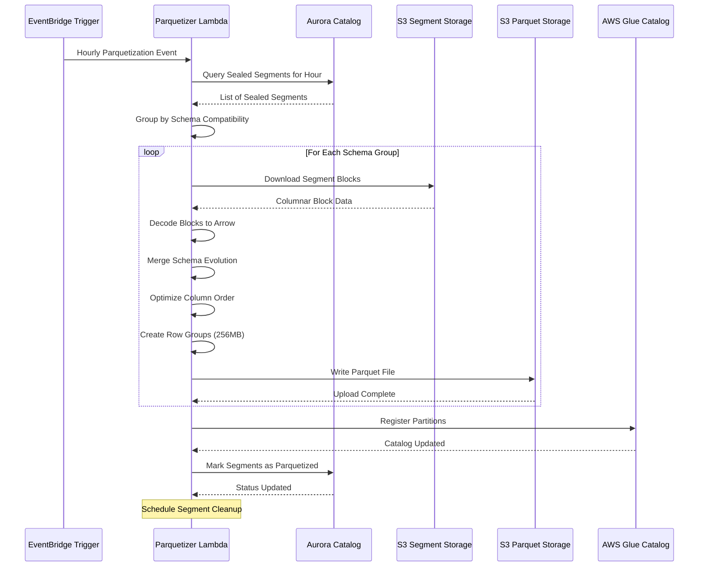

Parquet files are configured with:
- **Row Groups**: 128-512 MB for optimal scan performance
- **Compression**: Zstd for better compression than Snappy
- **Bloom Filters**: On high-cardinality columns like trace_id
- **Page Indexes**: For fine-grained pruning within row groups

### Parquet Optimization

#### Schema Evolution Handling
The system handles schema evolution gracefully by merging schemas from different segments. Incompatible type changes are resolved through promotion to string types, and new fields are added as nullable columns. This ensures backward compatibility while supporting evolving telemetry schemas.

#### Compression and Encoding
Parquet encoding is optimized based on column characteristics. Dictionary encoding is used for low-cardinality strings, delta encoding for temporal data, and run-length encoding for repetitive values. The system analyzes data patterns to select optimal encoding strategies for each column.

## Storage Lifecycle Management

### Data Retention Policies

The storage system implements configurable retention policies that balance cost, performance, and compliance requirements:

- **Hot Retention**: Data remains in EFS for 24 hours by default
- **Warm Retention**: S3 segments persist for 30 days before cleanup
- **Cold Retention**: Parquet files maintain 7-year retention for compliance
- **Archival**: Data transitions to Glacier after 2 years for cost optimization

Retention policies are enforced through automated cleanup processes that verify data integrity before deletion.

### Cost Optimization

#### S3 Lifecycle Policies
Automated lifecycle policies transition data through S3 storage classes based on access patterns:

- **Standard → Standard-IA**: After 30 days for reduced storage costs
- **Standard-IA → Glacier**: After 90 days for long-term archival
- **Glacier → Deep Archive**: After 2 years for compliance retention

#### Storage Monitoring
Comprehensive monitoring tracks storage costs and usage patterns across all tiers. Metrics include storage volumes by tier, compression ratios, query efficiency measurements, and cost attribution by tenant. This information drives optimization decisions and capacity planning.

The system provides detailed cost visibility including:
- EFS utilization and cost per tenant
- S3 storage distribution across storage classes
- Parquet compression efficiency
- Query scan efficiency ratios
