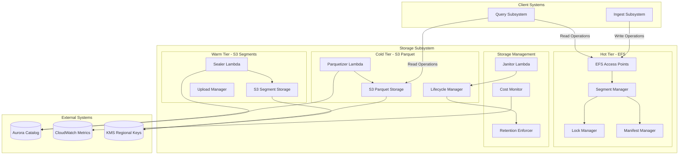
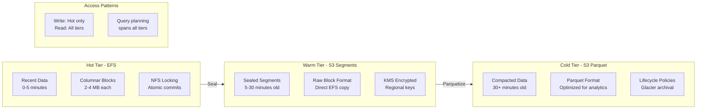
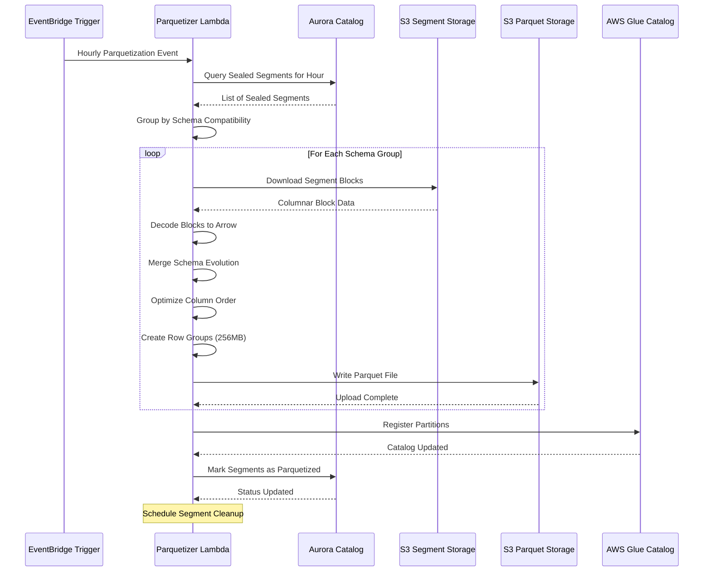

# Storage Subsystem Design

**Hot, Warm, and Cold Storage Tiers**

## Overview

The Storage subsystem implements a three-tier architecture optimizing for different access patterns and cost requirements. Hot data resides on EFS for low-latency access, warm data is stored as segments on S3, and cold data is compacted into Parquet format for cost-effective long-term storage.

## Storage Tiers Architecture

## C4 Container Diagram



### Tier Overview



## Hot Storage (EFS)

### Architecture

#### EFS Configuration
- **Type**: General Purpose EFS with Provisioned Throughput
- **Performance Mode**: General Purpose for balanced latency/throughput
- **Throughput Mode**: Provisioned for predictable performance
- **Encryption**: Encryption at rest and in transit
- **Access**: EFS Access Points for tenant isolation

#### Directory Structure
The hot storage layer organizes data in a hierarchical structure that facilitates efficient access patterns and maintains tenant isolation:

```
/efs/tenants/<tenant_id>/
├── datasets/<dataset_name>/
│   ├── segments/<segment_id>/
│   │   ├── .lock → lease-<uuid>@<expires_timestamp>
│   │   ├── .commit                    # Commit operation lock
│   │   ├── .seal                      # Seal operation lock  
│   │   ├── manifest/                  # Versioned manifests
│   │   ├── HEAD → manifest/latest.json
│   │   ├── columns/                   # Columnar data
│   │   │   ├── tenant_id/blocks/      # Column blocks
│   │   │   ├── timestamp/blocks/
│   │   │   ├── trace_id/blocks/
│   │   │   ├── tenant_id/stats/       # Block statistics
│   │   │   └── tenant_id/dict/        # Dictionary encodings
│   │   └── _segment.meta
│   └── virtual/containers/<container_name>/
```

### Segment Management

#### Segment Lifecycle States
Segments progress through well-defined states that govern their accessibility and processing:

- **Open**: Actively accepting new data writes
- **Sealing**: Being prepared for upload to warm storage
- **Sealed**: Uploaded to S3, available for queries but read-only
- **Parquetized**: Converted to Parquet format in cold storage

#### Time Windows and Partitioning
The system organizes data into time-based segments with configurable parameters:

- **Window Duration**: 5-minute segments balance write efficiency with query granularity
- **Lateness Tolerance**: 30-minute window accommodates late-arriving data
- **Size Limits**: 1GB maximum segment size triggers early sealing
- **Age Thresholds**: Minimum 5-minute age before sealing eligibility

Segment identifiers are deterministically generated from timestamps, enabling efficient time-based queries and eliminating coordination overhead.

### Columnar Block Format

#### Block Structure and Format

Each columnar block follows a standardized binary format that optimizes for both storage efficiency and query performance. The block format consists of a header section containing metadata, followed by the compressed data payload and optional index structures.

**Block Header Format**: The header contains a magic number for format identification, version information for backward compatibility, compression algorithm specification, encoding type indicators, and data size information. Statistical metadata includes row count, null count, distinct value estimates, and min/max values for efficient query pruning.

**Data Payload Structure**: The data section contains the actual column values in compressed, encoded format. Encoding strategies are selected based on data characteristics - timestamp columns use delta-of-delta compression, string columns employ dictionary encoding with optional run-length compression, and numeric columns utilize bit packing or delta encoding as appropriate.

**Index Structures**: Blocks may include optional index structures appended after the data payload. Bloom filters provide fast membership testing for high-cardinality columns like trace IDs and user identifiers. Dictionary indexes enable rapid lookup for categorical data, while zone maps provide additional pruning capabilities for numeric ranges.

**Integrity and Checksums**: Each block includes CRC32 checksums for data integrity verification during reads. Checksum validation occurs during decompression to detect storage-level corruption and ensure data reliability across the storage tiers.

#### Encoding Strategies

The storage system employs adaptive encoding strategies that optimize for both compression ratio and query performance:

**Timestamp Encoding**: Leverages temporal locality through delta-of-delta compression. Since timestamps in telemetry data are typically monotonic within segments, this approach achieves excellent compression ratios while maintaining fast random access.

**String Encoding**: Creates frequency-ordered dictionaries that place common values at low indices. Run-length encoding is applied when consecutive values repeat frequently. This approach works particularly well for categorical data like service names and log levels.

**Numeric Encoding**: Analyzes data patterns to select optimal representations. Monotonic sequences use delta encoding, small integers employ bit packing, and low-cardinality numeric data uses dictionary compression.

### Atomic Operations and Locking

#### NFS Symlink Locking
The system uses NFS symlink creation as an atomic locking primitive. Symlink targets encode lease information including unique identifiers and expiration timestamps. This approach provides the atomicity guarantees needed for concurrent writers while enabling automatic cleanup of stale locks.

The locking protocol uses minimal critical sections to maximize concurrency. Writers stage data in unique locations, then acquire brief locks only for manifest updates and HEAD pointer advancement.

#### Manifest Management
Segment manifests provide consistent views of block contents within each segment. The system uses versioned manifests with atomic HEAD pointer updates to ensure readers see complete, consistent segment states. Each manifest includes comprehensive block references, statistical summaries, and schema evolution information.

## Warm Storage (S3 Segments)

### Architecture

#### S3 Organization
Warm storage maintains the original block structure from EFS while providing cost-effective regional storage:

```
s3://prism-segments-{region}/
├── shard=00/
│   ├── tenants/{tenant_id}/
│   │   ├── datasets/{dataset}/
│   │   │   ├── seg/p=00/{segment_id}/
│   │   │   │   ├── columns/
│   │   │   │   ├── manifest/
│   │   │   │   └── _segment.meta
```

The partitioning scheme enables efficient pruning and parallel access while maintaining tenant isolation.

#### Sealing Process
Segment sealing transfers complete EFS segments to S3 while maintaining data integrity and consistency. The process involves acquiring exclusive locks, updating metadata states, performing the upload, and updating catalog information.

Sealing triggers are based on segment age, size thresholds, or explicit requests. The system ensures that sealed segments remain accessible for queries while freeing EFS capacity for new data.

### S3 Upload Optimization

#### Multipart Upload Strategy
Large segments use S3 multipart uploads for reliability and performance. The system automatically determines optimal part sizes, performs uploads in parallel, and handles retry logic for individual parts. This approach maximizes throughput while minimizing the impact of transient failures.

## Cold Storage (S3 Parquet)

### Architecture

#### Parquet Organization
Cold storage reorganizes data into analytics-optimized Parquet format with time-based partitioning:

```
s3://prism-analytics-{region}/
├── shard=00/
│   ├── tenant={tenant_id}/
│   │   ├── dataset={dataset}/
│   │   │   ├── dt=2024-01-15/
│   │   │   │   ├── hour=00/
│   │   │   │   │   ├── part-00000.parquet
│   │   │   │   │   └── _index.json
```

This organization supports efficient analytical queries with automatic partition pruning and parallel processing.

#### Parquetization Process and Optimization

The Parquetizer Lambda performs sophisticated data reorganization that transforms multiple sealed segments into optimally structured Parquet files. This process involves segment analysis, schema unification, data merging, and optimization for analytical query patterns.

**Segment Analysis and Grouping**: The parquetization process begins by analyzing sealed segments within time windows to identify schema compatibility groups. Segments with identical schemas can be merged directly, while segments with evolved schemas require schema unification procedures that promote incompatible types to common representations.

**Data Merging and Sorting**: Compatible segments are merged using sort operations that optimize for query performance. Data is typically sorted by timestamp and then by high-cardinality dimensions like trace_id to enable efficient range scans and improve compression ratios. The sorting process maintains logical consistency while maximizing physical layout efficiency.

**Row Group Optimization**: Parquet files are structured with carefully sized row groups that balance query performance with storage efficiency. Row groups are sized between 128-512 MB to optimize for parallel processing while maintaining manageable memory requirements. Column chunks within row groups are organized to maximize compression effectiveness.

**Metadata and Statistics**: Comprehensive metadata is generated for each Parquet file including schema information, row group statistics, and column-level metadata. Page-level statistics enable fine-grained pruning during query execution, while Bloom filters on selected columns provide additional filtering capabilities.

##### Parquetization Sequence



Parquet files are configured with:
- **Row Groups**: 128-512 MB for optimal scan performance
- **Compression**: Zstd for better compression than Snappy
- **Bloom Filters**: On high-cardinality columns like trace_id
- **Page Indexes**: For fine-grained pruning within row groups

### Parquet Optimization

#### Schema Evolution Handling
The system handles schema evolution gracefully by merging schemas from different segments. Incompatible type changes are resolved through promotion to string types, and new fields are added as nullable columns. This ensures backward compatibility while supporting evolving telemetry schemas.

#### Compression and Encoding
Parquet encoding is optimized based on column characteristics. Dictionary encoding is used for low-cardinality strings, delta encoding for temporal data, and run-length encoding for repetitive values. The system analyzes data patterns to select optimal encoding strategies for each column.

## Storage Lifecycle Management

### Data Retention Policies

The storage system implements configurable retention policies that balance cost, performance, and compliance requirements:

- **Hot Retention**: Data remains in EFS for 24 hours by default
- **Warm Retention**: S3 segments persist for 30 days before cleanup
- **Cold Retention**: Parquet files maintain 7-year retention for compliance
- **Archival**: Data transitions to Glacier after 2 years for cost optimization

Retention policies are enforced through automated cleanup processes that verify data integrity before deletion.

### Cost Optimization

#### S3 Lifecycle Policies
Automated lifecycle policies transition data through S3 storage classes based on access patterns:

- **Standard → Standard-IA**: After 30 days for reduced storage costs
- **Standard-IA → Glacier**: After 90 days for long-term archival
- **Glacier → Deep Archive**: After 2 years for compliance retention

#### Storage Monitoring
Comprehensive monitoring tracks storage costs and usage patterns across all tiers. Metrics include storage volumes by tier, compression ratios, query efficiency measurements, and cost attribution by tenant. This information drives optimization decisions and capacity planning.

The system provides detailed cost visibility including:
- EFS utilization and cost per tenant
- S3 storage distribution across storage classes
- Parquet compression efficiency
- Query scan efficiency ratios
